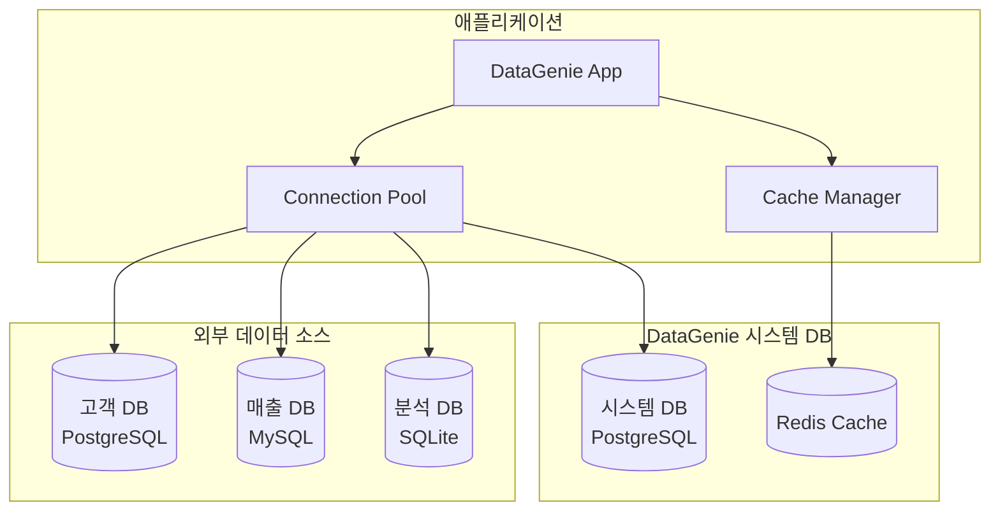

# DataGenie 데이터베이스 설계서

## 📋 문서 정보
- **프로젝트명**: DataGenie (LLM 기반 데이터 질의·분석·시각화 서비스)
- **작성일**: 2024년
- **버전**: 1.0

## 🎯 데이터베이스 설계 개요

### 설계 목적
- 외부 데이터베이스 연결 및 관리
- 사용자 세션 및 인증 정보 저장
- 시스템 설정 및 메타데이터 관리
- 쿼리 캐시 및 성능 최적화

### 설계 원칙
- **보안성**: 읽기 전용 연결, 개인정보 보호
- **확장성**: 멀티 데이터베이스 지원
- **성능**: 연결 풀링, 캐싱 전략
- **안정성**: 장애 복구, 모니터링

## 🗄️ 데이터베이스 아키텍처

### 1. 전체 데이터베이스 구조



### 2. 데이터베이스 역할 분리

#### **시스템 데이터베이스** (Internal)
```sql
-- DataGenie 자체 운영을 위한 데이터베이스
-- 역할: 사용자 관리, 설정, 로그, 캐시 메타데이터
-- 엔진: PostgreSQL 15+
-- 권한: 읽기/쓰기 전체 권한
```

#### **외부 데이터베이스** (External)
```sql
-- 분석 대상이 되는 외부 데이터베이스들
-- 역할: 비즈니스 데이터 조회
-- 엔진: PostgreSQL, MySQL, SQLite 지원
-- 권한: 읽기 전용 (SELECT만 허용)
```

#### **캐시 데이터베이스** (Cache)
```sql
-- Redis 기반 캐시 시스템
-- 역할: 쿼리 결과, 세션, 임시 데이터 저장
-- 엔진: Redis 7+
-- TTL: 자동 만료 설정
```

## 🔧 시스템 데이터베이스 스키마

### 1. 사용자 관리

#### users (사용자 정보)
```sql
CREATE TABLE users (
    id UUID PRIMARY KEY DEFAULT gen_random_uuid(),
    username VARCHAR(50) UNIQUE NOT NULL,
    email VARCHAR(255) UNIQUE NOT NULL,
    password_hash VARCHAR(255) NOT NULL,
    full_name VARCHAR(100),
    role VARCHAR(20) DEFAULT 'user' CHECK (role IN ('admin', 'user', 'viewer')),
    is_active BOOLEAN DEFAULT true,
    created_at TIMESTAMP WITH TIME ZONE DEFAULT CURRENT_TIMESTAMP,
    updated_at TIMESTAMP WITH TIME ZONE DEFAULT CURRENT_TIMESTAMP,
    last_login_at TIMESTAMP WITH TIME ZONE,
    
    -- 인덱스
    CONSTRAINT users_username_check CHECK (length(username) >= 3),
    CONSTRAINT users_email_check CHECK (email ~* '^[A-Za-z0-9._%+-]+@[A-Za-z0-9.-]+\.[A-Za-z]{2,}$')
);

-- 인덱스 생성
CREATE INDEX idx_users_username ON users(username);
CREATE INDEX idx_users_email ON users(email);
CREATE INDEX idx_users_role ON users(role);
CREATE INDEX idx_users_active ON users(is_active);
```

#### user_sessions (사용자 세션)
```sql
CREATE TABLE user_sessions (
    id UUID PRIMARY KEY DEFAULT gen_random_uuid(),
    user_id UUID NOT NULL REFERENCES users(id) ON DELETE CASCADE,
    session_token VARCHAR(255) UNIQUE NOT NULL,
    ip_address INET,
    user_agent TEXT,
    expires_at TIMESTAMP WITH TIME ZONE NOT NULL,
    created_at TIMESTAMP WITH TIME ZONE DEFAULT CURRENT_TIMESTAMP,
    last_activity_at TIMESTAMP WITH TIME ZONE DEFAULT CURRENT_TIMESTAMP,
    
    -- 자동 정리를 위한 체크
    CONSTRAINT session_expires_check CHECK (expires_at > created_at)
);

-- 인덱스 및 정리 작업
CREATE INDEX idx_sessions_token ON user_sessions(session_token);
CREATE INDEX idx_sessions_user_id ON user_sessions(user_id);
CREATE INDEX idx_sessions_expires ON user_sessions(expires_at);

-- 만료된 세션 자동 정리 (매일 실행)
CREATE OR REPLACE FUNCTION cleanup_expired_sessions()
RETURNS void AS $$
BEGIN
    DELETE FROM user_sessions WHERE expires_at < CURRENT_TIMESTAMP;
END;
$$ LANGUAGE plpgsql;
```

### 2. 데이터베이스 연결 관리

#### database_connections (외부 DB 연결 정보)
```sql
CREATE TABLE database_connections (
    id UUID PRIMARY KEY DEFAULT gen_random_uuid(),
    name VARCHAR(100) UNIQUE NOT NULL,
    display_name VARCHAR(200) NOT NULL,
    description TEXT,
    db_type VARCHAR(20) NOT NULL CHECK (db_type IN ('postgresql', 'mysql', 'sqlite')),
    
    -- 연결 정보 (암호화된 JSON)
    connection_config JSONB NOT NULL,
    
    -- 상태 및 권한
    is_active BOOLEAN DEFAULT true,
    is_readonly BOOLEAN DEFAULT true,
    max_connections INTEGER DEFAULT 10,
    
    -- 메타데이터
    schema_info JSONB, -- 테이블, 컬럼 정보 캐시
    last_schema_sync TIMESTAMP WITH TIME ZONE,
    
    -- 감사 정보
    created_by UUID REFERENCES users(id),
    created_at TIMESTAMP WITH TIME ZONE DEFAULT CURRENT_TIMESTAMP,
    updated_at TIMESTAMP WITH TIME ZONE DEFAULT CURRENT_TIMESTAMP,
    
    -- 제약조건
    CONSTRAINT conn_config_check CHECK (jsonb_typeof(connection_config) = 'object')
);

-- 인덱스
CREATE INDEX idx_db_connections_name ON database_connections(name);
CREATE INDEX idx_db_connections_type ON database_connections(db_type);
CREATE INDEX idx_db_connections_active ON database_connections(is_active);
```

#### connection_permissions (사용자별 DB 접근 권한)
```sql
CREATE TABLE connection_permissions (
    id UUID PRIMARY KEY DEFAULT gen_random_uuid(),
    user_id UUID NOT NULL REFERENCES users(id) ON DELETE CASCADE,
    connection_id UUID NOT NULL REFERENCES database_connections(id) ON DELETE CASCADE,
    
    -- 권한 설정
    can_query BOOLEAN DEFAULT true,
    allowed_schemas TEXT[], -- 허용된 스키마 목록
    allowed_tables TEXT[], -- 허용된 테이블 목록 (선택사항)
    
    -- 제한 설정
    max_rows_per_query INTEGER DEFAULT 10000,
    max_execution_time_seconds INTEGER DEFAULT 30,
    
    created_at TIMESTAMP WITH TIME ZONE DEFAULT CURRENT_TIMESTAMP,
    
    -- 유니크 제약
    UNIQUE(user_id, connection_id)
);

-- 인덱스
CREATE INDEX idx_conn_perms_user ON connection_permissions(user_id);
CREATE INDEX idx_conn_perms_connection ON connection_permissions(connection_id);
```

### 3. 쿼리 및 분석 이력

#### query_history (쿼리 실행 이력)
```sql
CREATE TABLE query_history (
    id UUID PRIMARY KEY DEFAULT gen_random_uuid(),
    user_id UUID NOT NULL REFERENCES users(id) ON DELETE CASCADE,
    connection_id UUID REFERENCES database_connections(id) ON DELETE SET NULL,
    
    -- 쿼리 정보
    question TEXT NOT NULL, -- 원본 자연어 질문
    generated_sql TEXT, -- 생성된 SQL (DB 쿼리인 경우)
    query_type VARCHAR(20) NOT NULL CHECK (query_type IN ('database', 'excel', 'general')),
    
    -- 실행 결과
    status VARCHAR(20) DEFAULT 'pending' CHECK (status IN ('pending', 'success', 'error', 'timeout')),
    error_message TEXT,
    row_count INTEGER,
    execution_time_ms INTEGER,
    
    -- 메타데이터
    result_hash VARCHAR(64), -- 결과 캐시 키
    file_info JSONB, -- Excel 파일 정보 (Excel 분석인 경우)
    
    created_at TIMESTAMP WITH TIME ZONE DEFAULT CURRENT_TIMESTAMP,
    
    -- 제약조건
    CONSTRAINT query_exec_time_check CHECK (execution_time_ms >= 0),
    CONSTRAINT query_row_count_check CHECK (row_count >= 0 OR row_count IS NULL)
);

-- 인덱스
CREATE INDEX idx_query_history_user ON query_history(user_id);
CREATE INDEX idx_query_history_connection ON query_history(connection_id);
CREATE INDEX idx_query_history_type ON query_history(query_type);
CREATE INDEX idx_query_history_status ON query_history(status);
CREATE INDEX idx_query_history_created ON query_history(created_at);
CREATE INDEX idx_query_history_hash ON query_history(result_hash);
```

#### analysis_results (분석 결과 메타데이터)
```sql
CREATE TABLE analysis_results (
    id UUID PRIMARY KEY DEFAULT gen_random_uuid(),
    query_history_id UUID NOT NULL REFERENCES query_history(id) ON DELETE CASCADE,
    
    -- 결과 정보
    chart_type VARCHAR(50), -- 생성된 차트 유형
    chart_config JSONB, -- 차트 설정
    summary_text TEXT, -- LLM 생성 요약
    insights JSONB, -- 추출된 인사이트
    
    -- 파일 정보
    result_files JSONB, -- 생성된 파일 경로들 (이미지, CSV 등)
    
    created_at TIMESTAMP WITH TIME ZONE DEFAULT CURRENT_TIMESTAMP
);

-- 인덱스
CREATE INDEX idx_analysis_results_query ON analysis_results(query_history_id);
CREATE INDEX idx_analysis_results_chart_type ON analysis_results(chart_type);
```

### 4. 시스템 설정 및 로그

#### system_settings (시스템 설정)
```sql
CREATE TABLE system_settings (
    key VARCHAR(100) PRIMARY KEY,
    value JSONB NOT NULL,
    description TEXT,
    category VARCHAR(50) DEFAULT 'general',
    is_sensitive BOOLEAN DEFAULT false, -- 민감 정보 여부
    
    updated_by UUID REFERENCES users(id),
    updated_at TIMESTAMP WITH TIME ZONE DEFAULT CURRENT_TIMESTAMP,
    
    -- 유효성 검증
    CONSTRAINT settings_key_format CHECK (key ~* '^[a-z][a-z0-9_]*$')
);

-- 기본 설정값 삽입
INSERT INTO system_settings (key, value, description, category) VALUES
('openai_model', '"gpt-4"', 'OpenAI 모델 선택', 'llm'),
('openai_temperature', '0.0', 'OpenAI 온도 설정', 'llm'),
('max_file_size_mb', '50', '최대 파일 크기 (MB)', 'file'),
('max_query_rows', '10000', '최대 쿼리 결과 행 수', 'query'),
('session_timeout_hours', '24', '세션 만료 시간 (시간)', 'auth'),
('cache_ttl_seconds', '3600', '캐시 TTL (초)', 'cache');

-- 인덱스
CREATE INDEX idx_settings_category ON system_settings(category);
```

#### audit_logs (감사 로그)
```sql
CREATE TABLE audit_logs (
    id UUID PRIMARY KEY DEFAULT gen_random_uuid(),
    user_id UUID REFERENCES users(id) ON DELETE SET NULL,
    
    -- 액션 정보
    action VARCHAR(100) NOT NULL, -- 수행한 액션
    resource_type VARCHAR(50) NOT NULL, -- 대상 리소스 타입
    resource_id VARCHAR(255), -- 대상 리소스 ID
    
    -- 요청 정보
    ip_address INET,
    user_agent TEXT,
    request_id UUID, -- 요청 추적용 ID
    
    -- 상세 정보
    details JSONB, -- 액션 상세 정보
    result VARCHAR(20) CHECK (result IN ('success', 'failure', 'partial')),
    
    created_at TIMESTAMP WITH TIME ZONE DEFAULT CURRENT_TIMESTAMP,
    
    -- 인덱스용 제약
    CONSTRAINT audit_action_check CHECK (length(action) > 0)
);

-- 인덱스 (시계열 데이터 최적화)
CREATE INDEX idx_audit_logs_user ON audit_logs(user_id);
CREATE INDEX idx_audit_logs_action ON audit_logs(action);
CREATE INDEX idx_audit_logs_resource ON audit_logs(resource_type, resource_id);
CREATE INDEX idx_audit_logs_created ON audit_logs(created_at DESC);
CREATE INDEX idx_audit_logs_result ON audit_logs(result);

-- 파티셔닝 설정 (월별)
-- 대용량 로그 처리를 위한 월별 파티셔닝
-- ALTER TABLE audit_logs PARTITION BY RANGE (created_at);
```

## 🔗 외부 데이터베이스 연결 설계

### 1. 연결 관리 전략

#### 연결 풀 구성
```python
# database/connection_manager.py
from sqlalchemy import create_engine
from sqlalchemy.pool import QueuePool
from typing import Dict, Any

class ConnectionManager:
    def __init__(self):
        self.connection_pools: Dict[str, Any] = {}
    
    def create_connection_pool(self, config: Dict[str, Any]) -> Any:
        """외부 DB 연결 풀 생성"""
        engine = create_engine(
            self._build_connection_url(config),
            poolclass=QueuePool,
            pool_size=config.get('pool_size', 5),
            max_overflow=config.get('max_overflow', 10),
            pool_pre_ping=True,  # 연결 유효성 검사
            pool_recycle=3600,   # 1시간마다 연결 재생성
            echo=False  # SQL 로깅 비활성화 (보안)
        )
        return engine
    
    def _build_connection_url(self, config: Dict[str, Any]) -> str:
        """연결 URL 생성"""
        db_type = config['db_type']
        host = config['host']
        port = config['port']
        database = config['database']
        username = config['username']
        password = config['password']  # 암호화된 상태로 저장
        
        if db_type == 'postgresql':
            return f"postgresql://{username}:{password}@{host}:{port}/{database}?sslmode=require"
        elif db_type == 'mysql':
            return f"mysql+pymysql://{username}:{password}@{host}:{port}/{database}?charset=utf8mb4"
        elif db_type == 'sqlite':
            return f"sqlite:///{database}"
        else:
            raise ValueError(f"지원하지 않는 DB 타입: {db_type}")
```

#### 스키마 정보 캐싱
```sql
-- 외부 DB의 스키마 정보를 캐시하여 성능 향상
CREATE TABLE cached_schema_info (
    connection_id UUID REFERENCES database_connections(id) ON DELETE CASCADE,
    schema_name VARCHAR(100),
    table_name VARCHAR(100),
    column_name VARCHAR(100),
    data_type VARCHAR(100),
    is_nullable BOOLEAN,
    column_default TEXT,
    is_primary_key BOOLEAN DEFAULT false,
    
    -- 메타데이터
    cached_at TIMESTAMP WITH TIME ZONE DEFAULT CURRENT_TIMESTAMP,
    
    PRIMARY KEY (connection_id, schema_name, table_name, column_name)
);

-- 인덱스
CREATE INDEX idx_cached_schema_connection ON cached_schema_info(connection_id);
CREATE INDEX idx_cached_schema_table ON cached_schema_info(connection_id, schema_name, table_name);
```

### 2. 보안 설정

#### 읽기 전용 사용자 생성 (PostgreSQL 예시)
```sql
-- 외부 PostgreSQL DB에서 실행할 스크립트
-- 1. 읽기 전용 사용자 생성
CREATE USER datagenie_readonly WITH PASSWORD 'secure_password_here';

-- 2. 기본 권한 제거
REVOKE ALL ON ALL TABLES IN SCHEMA public FROM datagenie_readonly;
REVOKE ALL ON ALL SEQUENCES IN SCHEMA public FROM datagenie_readonly;
REVOKE ALL ON ALL FUNCTIONS IN SCHEMA public FROM datagenie_readonly;

-- 3. 읽기 권한만 부여
GRANT CONNECT ON DATABASE your_database TO datagenie_readonly;
GRANT USAGE ON SCHEMA public TO datagenie_readonly;
GRANT SELECT ON ALL TABLES IN SCHEMA public TO datagenie_readonly;

-- 4. 새로 생성되는 테이블에도 자동으로 읽기 권한 부여
ALTER DEFAULT PRIVILEGES IN SCHEMA public GRANT SELECT ON TABLES TO datagenie_readonly;

-- 5. 개인정보 테이블 접근 제한 (예시)
REVOKE SELECT ON customers_personal_info FROM datagenie_readonly;
REVOKE SELECT ON user_passwords FROM datagenie_readonly;
```

#### MySQL 읽기 전용 사용자
```sql
-- MySQL에서 실행할 스크립트
-- 1. 읽기 전용 사용자 생성
CREATE USER 'datagenie_readonly'@'%' IDENTIFIED BY 'secure_password_here';

-- 2. 읽기 권한 부여
GRANT SELECT ON your_database.* TO 'datagenie_readonly'@'%';

-- 3. 개인정보 테이블 제외
REVOKE SELECT ON your_database.customers_personal_info FROM 'datagenie_readonly'@'%';
REVOKE SELECT ON your_database.user_passwords FROM 'datagenie_readonly'@'%';

-- 4. 권한 적용
FLUSH PRIVILEGES;
```

## 💾 Redis 캐시 설계

### 1. 캐시 키 구조

```python
# cache/key_patterns.py

# 캐시 키 패턴 정의
CACHE_KEY_PATTERNS = {
    # 쿼리 결과 캐시
    'query_result': 'datagenie:query:{connection_id}:{query_hash}',
    
    # 스키마 정보 캐시
    'schema_info': 'datagenie:schema:{connection_id}',
    
    # 세션 데이터
    'session': 'datagenie:session:{session_id}',
    
    # Excel 분석 결과
    'excel_analysis': 'datagenie:excel:{session_id}:{file_hash}',
    
    # LLM 응답 캐시
    'llm_response': 'datagenie:llm:{prompt_hash}',
    
    # 사용자 권한 캐시
    'user_permissions': 'datagenie:perms:{user_id}',
    
    # 시스템 설정 캐시
    'system_settings': 'datagenie:settings:{category}',
}

# TTL 설정 (초)
CACHE_TTL = {
    'query_result': 3600,      # 1시간
    'schema_info': 86400,      # 24시간
    'session': 86400,          # 24시간
    'excel_analysis': 3600,    # 1시간
    'llm_response': 7200,      # 2시간
    'user_permissions': 1800,  # 30분
    'system_settings': 3600,   # 1시간
}
```

### 2. 캐시 데이터 구조

#### 쿼리 결과 캐시
```json
{
  "sql": "SELECT * FROM products WHERE category = 'electronics'",
  "columns": ["id", "name", "price", "category"],
  "data": [
    {"id": 1, "name": "Laptop", "price": 1000, "category": "electronics"},
    {"id": 2, "name": "Phone", "price": 500, "category": "electronics"}
  ],
  "row_count": 2,
  "execution_time_ms": 150,
  "cached_at": "2024-01-15T10:30:00Z"
}
```

#### 스키마 정보 캐시
```json
{
  "connection_id": "uuid-here",
  "schemas": {
    "public": {
      "products": {
        "columns": {
          "id": {"type": "integer", "nullable": false, "primary_key": true},
          "name": {"type": "varchar", "nullable": false},
          "price": {"type": "decimal", "nullable": true},
          "category": {"type": "varchar", "nullable": true}
        },
        "indexes": ["products_pkey", "idx_products_category"]
      }
    }
  },
  "cached_at": "2024-01-15T09:00:00Z"
}
```

## 🔧 데이터베이스 초기화 및 마이그레이션

### 1. 초기화 스크립트

```python
# scripts/init_database.py
"""
DataGenie 데이터베이스 초기화 스크립트
"""
import asyncio
from sqlalchemy import create_engine, text
from app.config.settings import settings
import logging

logger = logging.getLogger(__name__)

async def create_database_structure():
    """데이터베이스 구조 생성"""
    engine = create_engine(settings.database_url)
    
    try:
        # 확장 기능 활성화
        with engine.connect() as conn:
            conn.execute(text("CREATE EXTENSION IF NOT EXISTS \"uuid-ossp\";"))
            conn.execute(text("CREATE EXTENSION IF NOT EXISTS \"pg_stat_statements\";"))
            conn.commit()
        
        # 테이블 생성 (순서 중요)
        await create_users_table(engine)
        await create_sessions_table(engine)
        await create_connections_table(engine)
        await create_permissions_table(engine)
        await create_query_history_table(engine)
        await create_analysis_results_table(engine)
        await create_system_settings_table(engine)
        await create_audit_logs_table(engine)
        await create_cached_schema_table(engine)
        
        # 기본 데이터 삽입
        await insert_default_data(engine)
        
        logger.info("데이터베이스 초기화 완료")
        
    except Exception as e:
        logger.error(f"데이터베이스 초기화 실패: {e}")
        raise
    finally:
        engine.dispose()

async def insert_default_data(engine):
    """기본 데이터 삽입"""
    with engine.connect() as conn:
        # 기본 관리자 계정 생성
        conn.execute(text("""
            INSERT INTO users (username, email, password_hash, full_name, role)
            VALUES ('admin', 'admin@datagenie.com', '$2b$12$example_hash', 'Administrator', 'admin')
            ON CONFLICT (username) DO NOTHING;
        """))
        
        # 시스템 설정 기본값
        conn.execute(text("""
            INSERT INTO system_settings (key, value, description, category) VALUES
            ('openai_model', '"gpt-4"', 'OpenAI 모델 선택', 'llm'),
            ('max_file_size_mb', '50', '최대 파일 크기', 'file'),
            ('max_query_rows', '10000', '최대 쿼리 결과 행 수', 'query')
            ON CONFLICT (key) DO NOTHING;
        """))
        
        conn.commit()

if __name__ == "__main__":
    asyncio.run(create_database_structure())
```

### 2. 마이그레이션 관리

```python
# scripts/migrations/001_initial_schema.py
"""
초기 스키마 생성 마이그레이션
"""

def upgrade():
    """스키마 업그레이드"""
    return [
        # 사용자 테이블 생성
        """
        CREATE TABLE users (
            id UUID PRIMARY KEY DEFAULT gen_random_uuid(),
            username VARCHAR(50) UNIQUE NOT NULL,
            email VARCHAR(255) UNIQUE NOT NULL,
            password_hash VARCHAR(255) NOT NULL,
            full_name VARCHAR(100),
            role VARCHAR(20) DEFAULT 'user',
            is_active BOOLEAN DEFAULT true,
            created_at TIMESTAMP WITH TIME ZONE DEFAULT CURRENT_TIMESTAMP,
            updated_at TIMESTAMP WITH TIME ZONE DEFAULT CURRENT_TIMESTAMP
        );
        """,
        
        # 인덱스 생성
        "CREATE INDEX idx_users_username ON users(username);",
        "CREATE INDEX idx_users_email ON users(email);",
        
        # 추가 테이블들...
    ]

def downgrade():
    """스키마 다운그레이드"""
    return [
        "DROP TABLE IF EXISTS users CASCADE;",
        # 기타 정리 작업...
    ]
```

## 📊 모니터링 및 유지보수

### 1. 성능 모니터링

```sql
-- 쿼리 성능 분석 뷰
CREATE VIEW query_performance_stats AS
SELECT 
    DATE_TRUNC('hour', created_at) as hour,
    connection_id,
    query_type,
    COUNT(*) as total_queries,
    AVG(execution_time_ms) as avg_execution_time,
    MAX(execution_time_ms) as max_execution_time,
    COUNT(*) FILTER (WHERE status = 'error') as error_count,
    COUNT(*) FILTER (WHERE status = 'timeout') as timeout_count
FROM query_history 
WHERE created_at >= CURRENT_TIMESTAMP - INTERVAL '7 days'
GROUP BY 1, 2, 3
ORDER BY 1 DESC;

-- 사용자 활동 통계
CREATE VIEW user_activity_stats AS
SELECT 
    u.username,
    u.role,
    COUNT(qh.id) as total_queries,
    MAX(qh.created_at) as last_query_at,
    COUNT(DISTINCT DATE(qh.created_at)) as active_days
FROM users u
LEFT JOIN query_history qh ON u.id = qh.user_id
WHERE u.is_active = true
GROUP BY u.id, u.username, u.role
ORDER BY total_queries DESC;
```

### 2. 정리 작업

```sql
-- 자동 정리 함수들
CREATE OR REPLACE FUNCTION cleanup_old_data()
RETURNS void AS $$
BEGIN
    -- 90일 이상 된 쿼리 이력 삭제
    DELETE FROM query_history 
    WHERE created_at < CURRENT_TIMESTAMP - INTERVAL '90 days';
    
    -- 만료된 세션 삭제
    DELETE FROM user_sessions 
    WHERE expires_at < CURRENT_TIMESTAMP;
    
    -- 180일 이상 된 감사 로그 삭제 (규정에 따라 조정)
    DELETE FROM audit_logs 
    WHERE created_at < CURRENT_TIMESTAMP - INTERVAL '180 days';
    
    -- 30일 이상 된 캐시된 스키마 정보 삭제
    DELETE FROM cached_schema_info 
    WHERE cached_at < CURRENT_TIMESTAMP - INTERVAL '30 days';
    
END;
$$ LANGUAGE plpgsql;

-- 매일 자정에 정리 작업 실행 (cron 설정 필요)
-- 0 0 * * * psql -d datagenie -c "SELECT cleanup_old_data();"
```

### 3. 백업 전략

```bash
#!/bin/bash
# scripts/backup_database.sh

DB_NAME="datagenie"
BACKUP_DIR="/backup/datagenie"
TIMESTAMP=$(date +"%Y%m%d_%H%M%S")

# 전체 백업
pg_dump -h localhost -U postgres -d $DB_NAME \
    --format=custom \
    --compress=9 \
    --file="$BACKUP_DIR/full_backup_$TIMESTAMP.dump"

# 스키마만 백업
pg_dump -h localhost -U postgres -d $DB_NAME \
    --schema-only \
    --file="$BACKUP_DIR/schema_backup_$TIMESTAMP.sql"

# 7일 이상 된 백업 파일 삭제
find $BACKUP_DIR -name "*.dump" -mtime +7 -delete
find $BACKUP_DIR -name "*.sql" -mtime +7 -delete

echo "백업 완료: $TIMESTAMP"
```

## 🔐 보안 고려사항

### 1. 데이터 암호화

```python
# security/encryption.py
from cryptography.fernet import Fernet
import os
import base64

class DatabaseConfigEncryption:
    def __init__(self):
        # 환경변수에서 암호화 키 로드
        key = os.getenv('ENCRYPTION_KEY')
        if not key:
            key = Fernet.generate_key()
            print(f"새 암호화 키 생성됨: {key.decode()}")
            print("이 키를 환경변수 ENCRYPTION_KEY에 설정하세요")
        
        self.cipher = Fernet(key if isinstance(key, bytes) else key.encode())
    
    def encrypt_connection_config(self, config: dict) -> str:
        """DB 연결 설정 암호화"""
        import json
        json_str = json.dumps(config)
        encrypted = self.cipher.encrypt(json_str.encode())
        return base64.b64encode(encrypted).decode()
    
    def decrypt_connection_config(self, encrypted_config: str) -> dict:
        """DB 연결 설정 복호화"""
        import json
        encrypted = base64.b64decode(encrypted_config.encode())
        decrypted = self.cipher.decrypt(encrypted)
        return json.loads(decrypted.decode())
```

### 2. 개인정보 마스킹

```sql
-- 개인정보 마스킹 함수
CREATE OR REPLACE FUNCTION mask_personal_data(
    data_type VARCHAR,
    original_value TEXT
) RETURNS TEXT AS $$
BEGIN
    CASE data_type
        WHEN 'email' THEN
            RETURN REGEXP_REPLACE(original_value, '(.{2})(.*)(@.*)', '\1***\3');
        WHEN 'phone' THEN
            RETURN REGEXP_REPLACE(original_value, '(.{3})(.*)(.{4})', '\1***\3');
        WHEN 'card_number' THEN
            RETURN REGEXP_REPLACE(original_value, '(.{4})(.*)(.{4})', '\1****\3');
        WHEN 'name' THEN
            RETURN LEFT(original_value, 1) || REPEAT('*', LENGTH(original_value) - 1);
        ELSE
            RETURN original_value;
    END CASE;
END;
$$ LANGUAGE plpgsql;
```

## 📈 확장 계획

### 1. 수평 확장 (Sharding)
- 사용자별 데이터 분산
- 지역별 데이터베이스 분리
- 읽기 전용 복제본 활용

### 2. 성능 최적화
- 파티셔닝 (시계열 데이터)
- 인덱스 최적화
- 쿼리 플랜 분석

### 3. 고가용성
- 마스터-슬레이브 복제
- 자동 장애 복구
- 백업 및 복구 자동화

---

**문서 승인**: ✅ 데이터베이스 설계 완료  
**다음 단계**: API 명세서 작성
