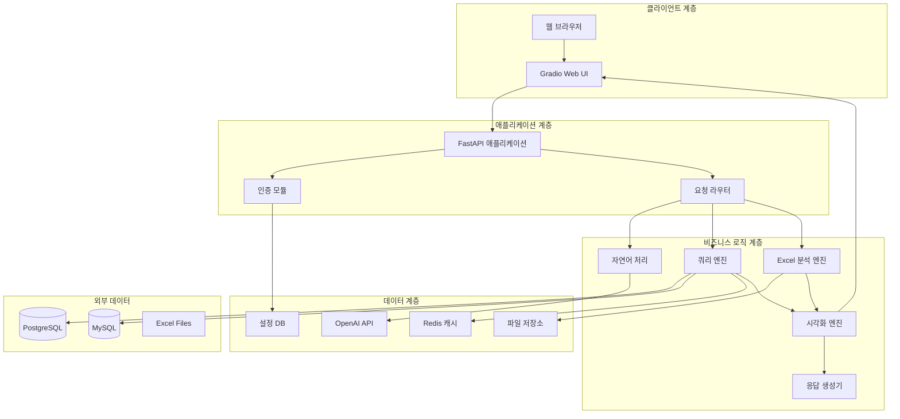

# DataGenie 시스템 아키텍처 설계서

## 📋 문서 정보
- **프로젝트명**: DataGenie (LLM 기반 데이터 질의·분석·시각화 서비스)
- **작성일**: 2024년
- **버전**: 1.0

## 🎯 아키텍처 개요

### 설계 원칙
- **모듈성**: 기능별 독립적 모듈 설계
- **확장성**: 사용자 증가 및 기능 확장 대응
- **안정성**: 장애 격리 및 복구 메커니즘
- **보안성**: 데이터 보호 및 접근 제어
- **성능**: 응답 시간 최적화

### 기술 스택 선정 기준
- **개발 속도**: 빠른 MVP 구현
- **안정성**: 검증된 오픈소스 라이브러리
- **확장성**: 사용자 증가에 대응 가능
- **비용 효율성**: 라이선스 및 운영 비용 최소화

## 🏗️ 전체 시스템 아키텍처



## 🔧 기술 스택

### 핵심 기술 스택

#### **백엔드 프레임워크**
```python
# 주요 의존성
fastapi==0.104.1          # 웹 프레임워크
uvicorn==0.24.0           # ASGI 서버
pydantic==2.4.2           # 데이터 검증
```

**선정 이유**:
- FastAPI: 빠른 개발, 자동 API 문서화, 타입 힌트 지원
- 비동기 처리로 높은 성능
- Gradio와 원활한 통합

#### **AI/ML 라이브러리**
```python
# LLM 및 자연어 처리
langchain==0.0.350        # LLM 체인 및 도구
openai==1.3.8             # OpenAI API 클라이언트
langchain-experimental==0.0.45  # 실험적 기능

# 데이터 분석
pandas==2.1.4             # 데이터 처리
numpy==1.24.4             # 수치 계산
scipy==1.11.4             # 통계 분석
```

**선정 이유**:
- LangChain: SQL 체인, 도구 통합, 프롬프트 관리
- 검증된 데이터 분석 라이브러리

#### **데이터베이스 연결**
```python
# 데이터베이스 드라이버
sqlalchemy==2.0.23        # ORM 및 커넥션 풀
psycopg2-binary==2.9.9    # PostgreSQL 드라이버
pymysql==1.1.0            # MySQL 드라이버
redis==5.0.1              # 캐시 클라이언트
```

#### **시각화 및 UI**
```python
# 시각화
plotly==5.17.0            # 인터랙티브 차트
matplotlib==3.8.2         # 기본 차트 (백업)

# 사용자 인터페이스
gradio==4.7.1             # 웹 UI 프레임워크
```

#### **파일 처리**
```python
# Excel 및 파일 처리
openpyxl==3.1.2           # Excel 읽기/쓰기
xlrd==2.0.1               # 구버전 Excel 지원
chardet==5.2.0            # 인코딩 감지
```

#### **기타 유틸리티**
```python
# 환경 설정 및 보안
python-dotenv==1.0.0      # 환경 변수 관리
cryptography==41.0.7      # 암호화
python-jose==3.3.0        # JWT 토큰

# 로깅 및 모니터링
structlog==23.2.0         # 구조화된 로깅
prometheus-client==0.19.0 # 메트릭 수집
```

### 지원 기술

#### **개발 도구**
```python
# 개발 및 테스트
pytest==7.4.3            # 테스트 프레임워크
black==23.11.0           # 코드 포매터
flake8==6.1.0            # 린터
mypy==1.7.1              # 타입 체커
```

#### **배포 및 인프라**
```dockerfile
# Docker 기반 배포
FROM python:3.11-slim
# 컨테이너 설정
```

## 🏛️ 상세 아키텍처 설계

### 1. 프레젠테이션 계층 (Presentation Layer)

#### 1.1 Gradio 웹 인터페이스
```python
# gradio_app.py
import gradio as gr
from typing import Tuple, Optional

class DataGenieUI:
    def __init__(self, backend_service):
        self.backend = backend_service
        self.setup_interface()
    
    def setup_interface(self):
        with gr.Blocks(title="DataGenie", theme=gr.themes.Soft()) as self.app:
            # 헤더
            gr.Markdown("# 🧞‍♂️ DataGenie - AI 데이터 분석 비서")
            
            with gr.Row():
                with gr.Column(scale=2):
                    # 질문 입력
                    question_input = gr.Textbox(
                        label="질문을 입력하세요",
                        placeholder="예: 월별 매출 현황을 보여줘",
                        lines=2
                    )
                    
                    # 파일 업로드
                    file_upload = gr.File(
                        label="Excel 파일 업로드",
                        file_types=[".xlsx", ".xls", ".csv"]
                    )
                    
                    submit_btn = gr.Button("분석 시작", variant="primary")
                
                with gr.Column(scale=1):
                    # 질문 이력
                    history = gr.Textbox(
                        label="최근 질문",
                        interactive=False,
                        max_lines=10
                    )
            
            # 결과 표시 영역
            with gr.Row():
                with gr.Column():
                    # 텍스트 응답
                    text_output = gr.Markdown(label="분석 결과")
                    
                    # 시각화
                    plot_output = gr.Plot(label="차트")
                    
                    # 데이터 테이블
                    data_output = gr.Dataframe(label="상세 데이터")
            
            # 이벤트 바인딩
            submit_btn.click(
                fn=self.process_question,
                inputs=[question_input, file_upload],
                outputs=[text_output, plot_output, data_output, history]
            )
```

#### 1.2 반응형 디자인
```css
/* 사용자 정의 CSS */
.gradio-container {
    max-width: 1200px;
    margin: 0 auto;
}

.question-input {
    font-size: 16px;
    border-radius: 8px;
}

.result-container {
    background: #f8f9fa;
    padding: 20px;
    border-radius: 12px;
    margin-top: 20px;
}

@media (max-width: 768px) {
    .gradio-row {
        flex-direction: column;
    }
}
```

### 2. 애플리케이션 계층 (Application Layer)

#### 2.1 FastAPI 백엔드 서비스
```python
# main.py
from fastapi import FastAPI, HTTPException
from contextlib import asynccontextmanager
import uvicorn

@asynccontextmanager
async def lifespan(app: FastAPI):
    # 시작시 초기화
    await initialize_services()
    yield
    # 종료시 정리
    await cleanup_services()

app = FastAPI(
    title="DataGenie API",
    description="LLM 기반 데이터 분석 서비스",
    version="1.0.0",
    lifespan=lifespan
)

# 미들웨어 설정
from fastapi.middleware.cors import CORSMiddleware
from fastapi.middleware.gzip import GZipMiddleware

app.add_middleware(
    CORSMiddleware,
    allow_origins=["*"],
    allow_methods=["*"],
    allow_headers=["*"],
)
app.add_middleware(GZipMiddleware, minimum_size=1000)

# 라우터 등록
from routes import analysis, health, auth
app.include_router(analysis.router, prefix="/api/analysis")
app.include_router(health.router, prefix="/api/health")
app.include_router(auth.router, prefix="/api/auth")
```

#### 2.2 요청 처리 플로우
```python
# services/analysis_service.py
from typing import Dict, Any, Optional
import asyncio

class AnalysisService:
    def __init__(self):
        self.nlp_processor = NLPProcessor()
        self.query_engine = QueryEngine()
        self.excel_engine = ExcelEngine()
        self.viz_engine = VisualizationEngine()
    
    async def process_question(
        self, 
        question: str, 
        file_data: Optional[bytes] = None,
        user_context: Dict[str, Any] = None
    ) -> Dict[str, Any]:
        """메인 질문 처리 워크플로우"""
        
        try:
            # 1. 질문 분석 및 라우팅
            analysis_result = await self.nlp_processor.analyze_question(question)
            
            # 2. 처리 유형에 따른 분기
            if analysis_result.type == "DB_QUERY":
                result = await self._process_db_query(question, analysis_result)
            elif analysis_result.type == "EXCEL_ANALYSIS":
                result = await self._process_excel_analysis(question, file_data)
            else:
                result = await self._process_general_question(question)
            
            # 3. 응답 생성
            response = await self._generate_response(result, analysis_result)
            
            return response
            
        except Exception as e:
            logger.error(f"분석 처리 오류: {e}")
            return self._create_error_response(str(e))
    
    async def _process_db_query(self, question: str, analysis: Any) -> Dict:
        """데이터베이스 쿼리 처리"""
        # SQL 생성
        sql_query = await self.query_engine.generate_sql(question, analysis)
        
        # 쿼리 실행
        data = await self.query_engine.execute_query(sql_query)
        
        # 시각화 생성
        visualization = await self.viz_engine.create_visualization(data)
        
        return {
            "type": "database",
            "sql_query": sql_query,
            "data": data,
            "visualization": visualization
        }
```

### 3. 비즈니스 로직 계층 (Business Logic Layer)

#### 3.1 자연어 처리 모듈
```python
# nlp/processor.py
from langchain.llms import OpenAI
from langchain.prompts import PromptTemplate
from pydantic import BaseModel
from typing import Literal

class QuestionAnalysis(BaseModel):
    type: Literal["DB_QUERY", "EXCEL_ANALYSIS", "GENERAL"]
    intent: str
    entities: Dict[str, Any]
    confidence: float
    suggested_tables: List[str] = []

class NLPProcessor:
    def __init__(self):
        self.llm = OpenAI(temperature=0)
        self.classification_prompt = PromptTemplate(
            input_variables=["question"],
            template="""
다음 사용자 질문을 분석하여 처리 유형을 분류하세요.

질문: {question}

분류 기준:
- DB_QUERY: 데이터베이스 조회가 필요한 질문
- EXCEL_ANALYSIS: 업로드된 엑셀 파일 분석 질문
- GENERAL: 일반적인 질문이나 도움말 요청

응답 형식:
{{
  "type": "DB_QUERY|EXCEL_ANALYSIS|GENERAL",
  "intent": "사용자 의도 설명",
  "entities": {{"추출된 엔티티": "값"}},
  "confidence": 0.95
}}
"""
        )
    
    async def analyze_question(self, question: str) -> QuestionAnalysis:
        """질문 분석 및 분류"""
        try:
            # LLM을 통한 질문 분석
            prompt = self.classification_prompt.format(question=question)
            response = await self.llm.agenerate([prompt])
            
            # 응답 파싱
            result = self._parse_llm_response(response.generations[0][0].text)
            
            # 추가 분석 (테이블 추천 등)
            if result.type == "DB_QUERY":
                result.suggested_tables = await self._suggest_tables(question)
            
            return result
            
        except Exception as e:
            logger.error(f"질문 분석 오류: {e}")
            return QuestionAnalysis(
                type="GENERAL",
                intent="분석 실패",
                entities={},
                confidence=0.0
            )
```

#### 3.2 쿼리 엔진
```python
# query/engine.py
from langchain.sql_database import SQLDatabase
from langchain.agents import create_sql_agent
from langchain.agents.agent_toolkits import SQLDatabaseToolkit
from sqlalchemy import create_engine, text
from typing import Dict, List, Any

class QueryEngine:
    def __init__(self):
        self.databases = {}
        self.agents = {}
        self._initialize_connections()
    
    def _initialize_connections(self):
        """데이터베이스 연결 초기화"""
        for db_name, config in DATABASE_CONFIGS.items():
            try:
                # SQLAlchemy 엔진 생성
                engine = create_engine(
                    f"{config['type']}://{config['username']}:{config['password']}"
                    f"@{config['host']}:{config['port']}/{config['database']}",
                    pool_size=10,
                    max_overflow=20,
                    pool_pre_ping=True
                )
                
                # LangChain SQLDatabase 래퍼
                db = SQLDatabase(engine)
                self.databases[db_name] = db
                
                # SQL Agent 생성
                toolkit = SQLDatabaseToolkit(db=db, llm=self.llm)
                agent = create_sql_agent(
                    llm=self.llm,
                    toolkit=toolkit,
                    verbose=True,
                    agent_type="zero-shot-react-description"
                )
                self.agents[db_name] = agent
                
                logger.info(f"데이터베이스 연결 성공: {db_name}")
                
            except Exception as e:
                logger.error(f"데이터베이스 연결 실패 {db_name}: {e}")
    
    async def generate_sql(self, question: str, analysis: QuestionAnalysis) -> str:
        """자연어 질문을 SQL로 변환"""
        try:
            # 기본 데이터베이스 선택
            db_name = "main_db"  # 설정에서 가져올 수도 있음
            agent = self.agents[db_name]
            
            # SQL 생성 프롬프트 구성
            enhanced_question = f"""
다음 질문에 대한 SQL 쿼리를 생성하세요:
{question}

제약사항:
- SELECT 쿼리만 허용 (INSERT, UPDATE, DELETE 금지)
- 결과 행 수를 1000개로 제한
- 개인정보가 포함된 컬럼은 마스킹 처리
- 실행 시간이 30초를 초과하지 않도록 최적화

추가 컨텍스트:
- 분석 유형: {analysis.intent}
- 추출된 엔티티: {analysis.entities}
"""
            
            # Agent를 통한 SQL 생성
            result = await agent.arun(enhanced_question)
            
            # SQL 추출 및 검증
            sql_query = self._extract_sql_from_result(result)
            validated_sql = self._validate_sql(sql_query)
            
            return validated_sql
            
        except Exception as e:
            logger.error(f"SQL 생성 오류: {e}")
            raise HTTPException(status_code=400, detail=f"SQL 생성 실패: {e}")
    
    async def execute_query(self, sql_query: str, db_name: str = "main_db") -> Dict[str, Any]:
        """SQL 쿼리 실행"""
        try:
            db = self.databases[db_name]
            
            # 쿼리 실행 (타임아웃 설정)
            with asyncio.timeout(30):  # 30초 타임아웃
                result = db.run(sql_query)
            
            # 결과 처리
            processed_result = self._process_query_result(result)
            
            return {
                "sql": sql_query,
                "data": processed_result["data"],
                "columns": processed_result["columns"],
                "row_count": processed_result["row_count"],
                "execution_time": processed_result["execution_time"]
            }
            
        except asyncio.TimeoutError:
            raise HTTPException(status_code=408, detail="쿼리 실행 시간 초과")
        except Exception as e:
            logger.error(f"쿼리 실행 오류: {e}")
            raise HTTPException(status_code=500, detail=f"쿼리 실행 실패: {e}")
```

#### 3.3 Excel 분석 엔진
```python
# excel/engine.py
import pandas as pd
import io
from typing import Dict, Any, Optional
import asyncio
from concurrent.futures import ThreadPoolExecutor

class ExcelEngine:
    def __init__(self):
        self.executor = ThreadPoolExecutor(max_workers=4)
        self.active_sessions = {}  # 세션별 데이터 저장
    
    async def process_file(self, file_data: bytes, session_id: str) -> Dict[str, Any]:
        """Excel 파일 처리 및 분석"""
        try:
            # 비동기 파일 처리
            loop = asyncio.get_event_loop()
            result = await loop.run_in_executor(
                self.executor, 
                self._process_file_sync, 
                file_data
            )
            
            # 세션에 데이터 저장
            self.active_sessions[session_id] = {
                "dataframe": result["dataframe"],
                "metadata": result["metadata"],
                "created_at": asyncio.get_event_loop().time()
            }
            
            return result
            
        except Exception as e:
            logger.error(f"Excel 파일 처리 오류: {e}")
            raise HTTPException(status_code=400, detail=f"파일 처리 실패: {e}")
    
    def _process_file_sync(self, file_data: bytes) -> Dict[str, Any]:
        """동기 파일 처리 (별도 스레드에서 실행)"""
        # 파일 형식 감지
        file_obj = io.BytesIO(file_data)
        
        try:
            # Excel 파일 읽기
            if file_data[:4] == b'PK\x03\x04':  # xlsx 시그니처
                df = pd.read_excel(file_obj, engine='openpyxl')
            else:
                # CSV 시도
                file_obj.seek(0)
                encoding = self._detect_encoding(file_data)
                df = pd.read_csv(file_obj, encoding=encoding)
            
            # 데이터 검증
            if len(df) > 1_000_000:
                raise ValueError("파일 크기가 너무 큽니다 (최대 100만 행)")
            
            # 메타데이터 추출
            metadata = self._extract_metadata(df)
            
            return {
                "dataframe": df,
                "metadata": metadata,
                "preview": df.head(10).to_dict('records'),
                "shape": df.shape,
                "columns": df.columns.tolist(),
                "dtypes": df.dtypes.to_dict()
            }
            
        except Exception as e:
            raise ValueError(f"파일 파싱 오류: {e}")
    
    async def analyze_data(self, question: str, session_id: str) -> Dict[str, Any]:
        """데이터 분석 수행"""
        if session_id not in self.active_sessions:
            raise HTTPException(status_code=404, detail="세션 데이터를 찾을 수 없습니다")
        
        df = self.active_sessions[session_id]["dataframe"]
        metadata = self.active_sessions[session_id]["metadata"]
        
        try:
            # Pandas 코드 생성
            analysis_code = await self._generate_analysis_code(question, df, metadata)
            
            # 코드 실행
            result = await self._execute_analysis_code(analysis_code, df)
            
            return {
                "question": question,
                "code": analysis_code,
                "result": result,
                "data_summary": self._summarize_result(result)
            }
            
        except Exception as e:
            logger.error(f"데이터 분석 오류: {e}")
            raise HTTPException(status_code=500, detail=f"분석 실패: {e}")
```

#### 3.4 시각화 엔진
```python
# visualization/engine.py
import plotly.express as px
import plotly.graph_objects as go
from plotly.subplots import make_subplots
import pandas as pd
from typing import Dict, Any, Optional, Literal

class VisualizationEngine:
    def __init__(self):
        self.chart_configs = self._load_chart_configurations()
    
    async def create_visualization(
        self, 
        data: pd.DataFrame, 
        chart_type: Optional[str] = None,
        question_context: Optional[str] = None
    ) -> Dict[str, Any]:
        """데이터 시각화 생성"""
        
        try:
            # 차트 유형 자동 결정
            if not chart_type:
                chart_type = self._recommend_chart_type(data, question_context)
            
            # 차트 생성
            fig = await self._create_chart(data, chart_type)
            
            # 한글 폰트 및 테마 적용
            fig.update_layout(
                font_family="Malgun Gothic, Arial",
                template="plotly_white",
                title_font_size=16,
                showlegend=True
            )
            
            return {
                "chart_type": chart_type,
                "figure": fig.to_json(),
                "html": fig.to_html(include_plotlyjs='cdn'),
                "config": {
                    "displayModeBar": True,
                    "displaylogo": False,
                    "modeBarButtonsToRemove": ['pan2d', 'lasso2d']
                }
            }
            
        except Exception as e:
            logger.error(f"시각화 생성 오류: {e}")
            return self._create_fallback_table(data)
    
    def _recommend_chart_type(self, data: pd.DataFrame, context: str) -> str:
        """데이터 특성에 따른 차트 유형 추천"""
        
        # 데이터 분석
        numeric_columns = data.select_dtypes(include=['number']).columns
        datetime_columns = data.select_dtypes(include=['datetime']).columns
        categorical_columns = data.select_dtypes(include=['object']).columns
        
        # 시계열 데이터 감지
        if len(datetime_columns) > 0 and len(numeric_columns) > 0:
            return "line"
        
        # 카테고리별 집계 데이터
        if len(categorical_columns) > 0 and len(numeric_columns) > 0:
            if data.shape[0] <= 20:  # 카테고리가 적으면
                return "bar"
            else:
                return "histogram"
        
        # 두 수치형 변수
        if len(numeric_columns) >= 2:
            return "scatter"
        
        # 단일 수치형 변수 분포
        if len(numeric_columns) == 1:
            return "histogram"
        
        # 기본값
        return "table"
    
    async def _create_chart(self, data: pd.DataFrame, chart_type: str) -> go.Figure:
        """차트 유형별 생성"""
        
        if chart_type == "bar":
            return self._create_bar_chart(data)
        elif chart_type == "line":
            return self._create_line_chart(data)
        elif chart_type == "pie":
            return self._create_pie_chart(data)
        elif chart_type == "scatter":
            return self._create_scatter_chart(data)
        elif chart_type == "histogram":
            return self._create_histogram(data)
        else:
            return self._create_table_chart(data)
    
    def _create_bar_chart(self, data: pd.DataFrame) -> go.Figure:
        """막대 그래프 생성"""
        # 첫 번째 텍스트 컬럼을 x축, 첫 번째 숫자 컬럼을 y축으로
        text_col = data.select_dtypes(include=['object']).columns[0]
        numeric_col = data.select_dtypes(include=['number']).columns[0]
        
        fig = px.bar(
            data, 
            x=text_col, 
            y=numeric_col,
            title=f"{text_col}별 {numeric_col}",
            color=numeric_col,
            color_continuous_scale="Blues"
        )
        
        fig.update_xaxes(tickangle=45)
        return fig
```

### 4. 데이터 계층 (Data Layer)

#### 4.1 캐시 시스템 (Redis)
```python
# cache/redis_client.py
import redis.asyncio as redis
import json
import pickle
from typing import Any, Optional, Union
import hashlib

class CacheManager:
    def __init__(self):
        self.redis_client = redis.from_url(
            "redis://localhost:6379/0",
            encoding="utf-8",
            decode_responses=False
        )
    
    async def get_query_result(self, sql_query: str) -> Optional[Dict[str, Any]]:
        """쿼리 결과 캐시 조회"""
        cache_key = self._generate_cache_key("sql", sql_query)
        
        try:
            cached_data = await self.redis_client.get(cache_key)
            if cached_data:
                return pickle.loads(cached_data)
            return None
        except Exception as e:
            logger.warning(f"캐시 조회 실패: {e}")
            return None
    
    async def set_query_result(
        self, 
        sql_query: str, 
        result: Dict[str, Any], 
        ttl: int = 3600
    ):
        """쿼리 결과 캐시 저장"""
        cache_key = self._generate_cache_key("sql", sql_query)
        
        try:
            serialized_data = pickle.dumps(result)
            await self.redis_client.setex(cache_key, ttl, serialized_data)
        except Exception as e:
            logger.warning(f"캐시 저장 실패: {e}")
    
    def _generate_cache_key(self, prefix: str, content: str) -> str:
        """캐시 키 생성"""
        content_hash = hashlib.md5(content.encode()).hexdigest()
        return f"datagenie:{prefix}:{content_hash}"
```

#### 4.2 설정 관리
```python
# config/settings.py
from pydantic import BaseSettings
from typing import Dict, Any

class Settings(BaseSettings):
    # 애플리케이션 설정
    app_name: str = "DataGenie"
    app_version: str = "1.0.0"
    debug: bool = False
    
    # OpenAI 설정
    openai_api_key: str
    openai_model: str = "gpt-4"
    openai_temperature: float = 0.0
    
    # 데이터베이스 설정
    database_configs: Dict[str, Any] = {
        "main_db": {
            "type": "postgresql",
            "host": "localhost",
            "port": 5432,
            "database": "company_db",
            "username": "readonly_user",
            "password": "",
        }
    }
    
    # Redis 설정
    redis_url: str = "redis://localhost:6379/0"
    
    # 파일 설정
    max_file_size: int = 50 * 1024 * 1024  # 50MB
    max_rows: int = 1_000_000
    upload_dir: str = "/tmp/datagenie"
    
    # 보안 설정
    secret_key: str
    jwt_algorithm: str = "HS256"
    jwt_expire_hours: int = 24
    
    class Config:
        env_file = ".env"
        env_file_encoding = "utf-8"

settings = Settings()
```

## 🔄 데이터 플로우

### 1. 일반적인 질의 플로우
```
사용자 질문 입력
       ↓
Gradio UI → FastAPI
       ↓
질문 분석 (NLP)
       ↓
    ┌─────────┬─────────┐
    ↓         ↓         ↓
 DB 쿼리   Excel 분석  일반응답
    ↓         ↓         ↓
캐시 확인   파일 처리   LLM 응답
    ↓         ↓         ↓
SQL 실행   코드 실행   형식화
    ↓         ↓         ↓
    └─────────┼─────────┘
             ↓
       시각화 생성
             ↓
       응답 조합
             ↓
     Gradio UI 출력
```

### 2. 캐싱 전략
```python
# 캐시 계층 구조
Level 1: 메모리 캐시 (빠른 접근, 제한된 용량)
Level 2: Redis 캐시 (중간 속도, 세션 공유)
Level 3: 데이터베이스 (느린 속도, 영구 저장)

캐시 키 구조:
- 쿼리 결과: "datagenie:sql:{hash}"
- 파일 분석: "datagenie:excel:{session_id}:{hash}"
- LLM 응답: "datagenie:llm:{prompt_hash}"
```

## 🛡️ 보안 아키텍처

### 1. 인증 및 권한
```python
# auth/security.py
from fastapi import Depends, HTTPException, status
from fastapi.security import HTTPBearer, HTTPAuthorizationCredentials
from jose import jwt, JWTError
import bcrypt

class SecurityManager:
    def __init__(self):
        self.security = HTTPBearer()
    
    async def get_current_user(
        self, 
        credentials: HTTPAuthorizationCredentials = Depends(HTTPBearer())
    ) -> Dict[str, Any]:
        """JWT 토큰 검증 및 사용자 정보 반환"""
        try:
            payload = jwt.decode(
                credentials.credentials, 
                settings.secret_key, 
                algorithms=[settings.jwt_algorithm]
            )
            user_id = payload.get("sub")
            if user_id is None:
                raise HTTPException(
                    status_code=status.HTTP_401_UNAUTHORIZED,
                    detail="Invalid authentication credentials"
                )
            return {"user_id": user_id, "permissions": payload.get("permissions", [])}
        except JWTError:
            raise HTTPException(
                status_code=status.HTTP_401_UNAUTHORIZED,
                detail="Invalid authentication credentials"
            )
```

### 2. SQL Injection 방지
```python
# security/sql_validator.py
import sqlparse
from typing import List

class SQLValidator:
    FORBIDDEN_KEYWORDS = [
        'DROP', 'DELETE', 'INSERT', 'UPDATE', 'ALTER', 'CREATE',
        'TRUNCATE', 'EXEC', 'EXECUTE', 'MERGE', 'CALL'
    ]
    
    def validate_sql(self, sql: str) -> bool:
        """SQL 쿼리 안전성 검증"""
        try:
            # 파싱 시도
            parsed = sqlparse.parse(sql)
            
            for statement in parsed:
                # DML/DDL 명령어 검사
                if self._contains_forbidden_keywords(statement):
                    raise ValueError("위험한 SQL 명령어 감지")
                
                # 서브쿼리 깊이 제한
                if self._count_subquery_depth(statement) > 3:
                    raise ValueError("서브쿼리 깊이 초과")
            
            return True
            
        except Exception as e:
            logger.warning(f"SQL 검증 실패: {e}")
            return False
```

## 📊 모니터링 및 로깅

### 1. 로깅 구조
```python
# logging/config.py
import structlog
import logging

def setup_logging():
    logging.basicConfig(
        format="%(message)s",
        stream=sys.stdout,
        level=logging.INFO,
    )
    
    structlog.configure(
        processors=[
            structlog.stdlib.filter_by_level,
            structlog.stdlib.add_log_level,
            structlog.stdlib.add_logger_name,
            structlog.stdlib.PositionalArgumentsFormatter(),
            structlog.processors.TimeStamper(fmt="iso"),
            structlog.processors.StackInfoRenderer(),
            structlog.processors.format_exc_info,
            structlog.processors.UnicodeDecoder(),
            structlog.processors.JSONRenderer()
        ],
        context_class=dict,
        logger_factory=structlog.stdlib.LoggerFactory(),
        wrapper_class=structlog.stdlib.BoundLogger,
        cache_logger_on_first_use=True,
    )

logger = structlog.get_logger()
```

### 2. 메트릭 수집
```python
# monitoring/metrics.py
from prometheus_client import Counter, Histogram, Gauge

# 요청 메트릭
request_count = Counter(
    'datagenie_requests_total',
    'Total requests',
    ['method', 'endpoint', 'status']
)

request_duration = Histogram(
    'datagenie_request_duration_seconds',
    'Request duration',
    ['method', 'endpoint']
)

# 비즈니스 메트릭
query_count = Counter(
    'datagenie_queries_total',
    'Total queries processed',
    ['type', 'status']
)

active_sessions = Gauge(
    'datagenie_active_sessions',
    'Number of active sessions'
)

# LLM 메트릭
llm_tokens = Counter(
    'datagenie_llm_tokens_total',
    'Total LLM tokens used',
    ['model', 'type']
)
```

## 🚀 배포 아키텍처

### 1. Docker 컨테이너 구성
```dockerfile
# Dockerfile
FROM python:3.11-slim

WORKDIR /app

# 시스템 의존성 설치
RUN apt-get update && apt-get install -y \
    gcc \
    g++ \
    && rm -rf /var/lib/apt/lists/*

# Python 의존성 설치
COPY requirements.txt .
RUN pip install --no-cache-dir -r requirements.txt

# 애플리케이션 코드
COPY . .

# 포트 노출
EXPOSE 8000

# 헬스체크
HEALTHCHECK --interval=30s --timeout=30s --start-period=5s --retries=3 \
    CMD curl -f http://localhost:8000/api/health || exit 1

# 실행 명령
CMD ["uvicorn", "main:app", "--host", "0.0.0.0", "--port", "8000"]
```

### 2. Docker Compose 구성
```yaml
# docker-compose.yml
version: '3.8'

services:
  app:
    build: .
    ports:
      - "8000:8000"
    environment:
      - OPENAI_API_KEY=${OPENAI_API_KEY}
      - DATABASE_URL=${DATABASE_URL}
      - REDIS_URL=redis://redis:6379/0
    depends_on:
      - redis
      - postgres
    volumes:
      - ./uploads:/app/uploads
    restart: unless-stopped

  redis:
    image: redis:7-alpine
    ports:
      - "6379:6379"
    volumes:
      - redis_data:/data
    restart: unless-stopped

  postgres:
    image: postgres:15
    environment:
      - POSTGRES_DB=datagenie
      - POSTGRES_USER=postgres
      - POSTGRES_PASSWORD=password
    ports:
      - "5432:5432"
    volumes:
      - postgres_data:/var/lib/postgresql/data
    restart: unless-stopped

volumes:
  redis_data:
  postgres_data:
```

## 🔧 개발 환경 설정

### 1. 프로젝트 구조
```
datagenie/
├── app/
│   ├── main.py                 # FastAPI 앱 엔트리포인트
│   ├── config/
│   │   ├── settings.py         # 설정 관리
│   │   └── database.py         # DB 연결 설정
│   ├── nlp/
│   │   ├── processor.py        # 자연어 처리
│   │   └── prompts.py          # 프롬프트 템플릿
│   ├── query/
│   │   ├── engine.py           # 쿼리 엔진
│   │   └── validator.py        # SQL 검증
│   ├── excel/
│   │   ├── engine.py           # Excel 처리
│   │   └── analyzer.py         # 데이터 분석
│   ├── visualization/
│   │   ├── engine.py           # 시각화 생성
│   │   └── templates.py        # 차트 템플릿
│   ├── auth/
│   │   └── security.py         # 인증/보안
│   ├── cache/
│   │   └── redis_client.py     # 캐시 관리
│   └── ui/
│       └── gradio_app.py       # Gradio UI
├── tests/                      # 테스트 코드
├── docs/                       # 문서
├── requirements.txt            # Python 의존성
├── docker-compose.yml          # 개발 환경
├── Dockerfile                  # 컨테이너 이미지
└── README.md                   # 프로젝트 가이드
```

### 2. 개발 스크립트
```bash
#!/bin/bash
# scripts/dev-setup.sh

echo "DataGenie 개발 환경 설정 시작..."

# Python 가상환경 생성
python -m venv venv
source venv/bin/activate

# 의존성 설치
pip install -r requirements.txt
pip install -r requirements-dev.txt

# 환경변수 파일 생성
if [ ! -f .env ]; then
    cp .env.example .env
    echo "✅ .env 파일이 생성되었습니다. API 키를 설정하세요."
fi

# Docker 서비스 시작
docker-compose up -d redis postgres

# 데이터베이스 초기화
python scripts/init_db.py

echo "🎉 개발 환경 설정 완료!"
echo "다음 명령으로 서버를 시작하세요:"
echo "uvicorn app.main:app --reload --host 0.0.0.0 --port 8000"
```

---

**문서 승인**: ✅ 시스템 아키텍처 설계 완료  
**다음 단계**: 데이터베이스 설계서 작성
