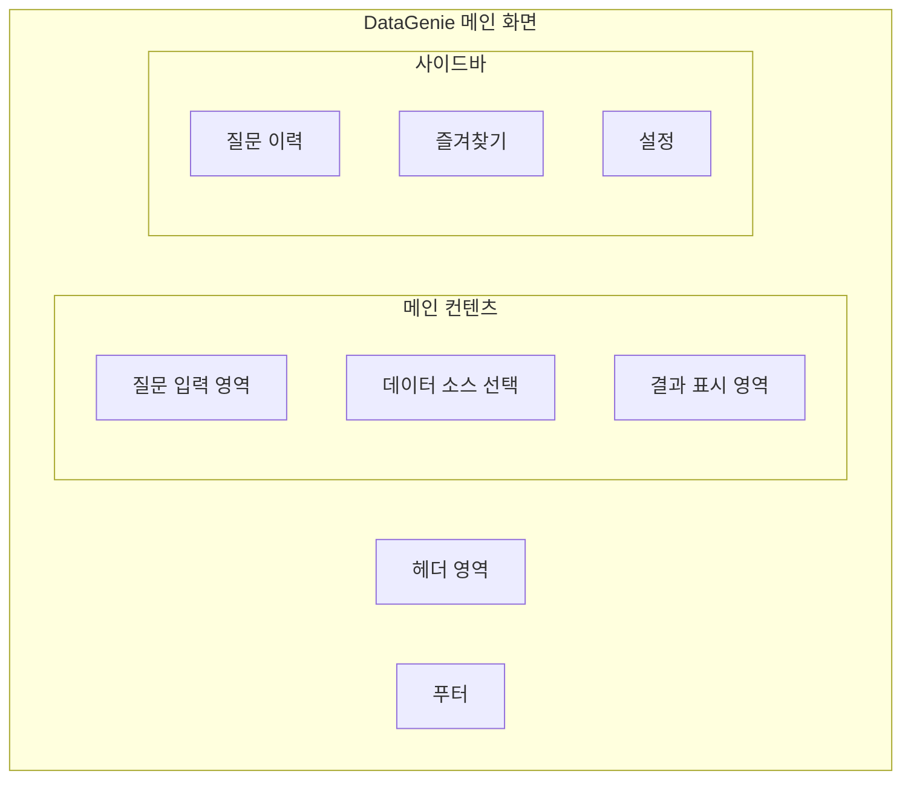

# DataGenie UI/UX 설계서

## 📋 문서 정보
- **프로젝트명**: DataGenie (LLM 기반 데이터 질의·분석·시각화 서비스)
- **작성일**: 2024년
- **버전**: 1.0

## 🎯 UI/UX 설계 개요

### 설계 철학
- **직관성**: 기술 지식 없이도 쉽게 사용 가능
- **효율성**: 최소한의 클릭으로 원하는 결과 도출
- **일관성**: 통일된 디자인 시스템과 인터랙션
- **반응성**: 다양한 디바이스에서 최적화된 경험
- **접근성**: 웹 접근성 표준 준수

### 핵심 사용자 여정
```
질문 입력 → 데이터 선택 → 분석 실행 → 결과 확인 → 추가 분석 또는 내보내기
```

### 디자인 원칙
1. **대화형 인터페이스**: 자연스러운 질문-답변 형태
2. **시각적 피드백**: 진행 상황과 결과를 명확히 표시
3. **점진적 공개**: 필요한 정보만 단계별로 노출
4. **오류 예방**: 사용자 실수를 미리 방지하는 설계
5. **개인화**: 사용자 습관에 맞는 맞춤형 경험

## 🖥️ 전체 레이아웃 구조

### 1. 메인 레이아웃



### 2. 화면 구성 비율

```css
/* 데스크톱 (1200px 이상) */
.main-layout {
    display: grid;
    grid-template-columns: 300px 1fr;
    grid-template-rows: 60px 1fr 40px;
    height: 100vh;
}

/* 태블릿 (768px - 1199px) */
@media (max-width: 1199px) {
    .main-layout {
        grid-template-columns: 250px 1fr;
    }
}

/* 모바일 (767px 이하) */
@media (max-width: 767px) {
    .main-layout {
        grid-template-columns: 1fr;
        grid-template-rows: 60px 1fr 40px;
    }
    
    .sidebar {
        position: fixed;
        transform: translateX(-100%);
        transition: transform 0.3s ease;
    }
    
    .sidebar.open {
        transform: translateX(0);
    }
}
```

## 🎨 디자인 시스템

### 1. 색상 팔레트

#### 주요 색상
```css
:root {
    /* 브랜드 색상 */
    --primary-color: #2563EB;      /* 파란색 - 신뢰, 전문성 */
    --primary-light: #3B82F6;
    --primary-dark: #1D4ED8;
    
    /* 보조 색상 */
    --secondary-color: #10B981;    /* 녹색 - 성공, 완료 */
    --accent-color: #F59E0B;       /* 주황색 - 주의, 강조 */
    --danger-color: #EF4444;       /* 빨간색 - 오류, 경고 */
    
    /* 중성 색상 */
    --gray-50: #F9FAFB;
    --gray-100: #F3F4F6;
    --gray-200: #E5E7EB;
    --gray-300: #D1D5DB;
    --gray-500: #6B7280;
    --gray-700: #374151;
    --gray-900: #111827;
    
    /* 배경 색상 */
    --bg-primary: #FFFFFF;
    --bg-secondary: #F9FAFB;
    --bg-dark: #1F2937;
}
```

#### 색상 사용 기준
- **Primary Blue**: 주요 액션 버튼, 링크, 선택 상태
- **Secondary Green**: 성공 메시지, 완료 상태, 긍정적 지표
- **Accent Orange**: 주의 사항, 중요 알림, 하이라이트
- **Danger Red**: 오류 메시지, 삭제 액션, 경고

### 2. 타이포그래피

```css
/* 폰트 패밀리 */
.font-primary {
    font-family: 'Pretendard', 'Noto Sans KR', 'Apple SD Gothic Neo', 
                 'Malgun Gothic', sans-serif;
}

.font-mono {
    font-family: 'JetBrains Mono', 'Consolas', 'Monaco', monospace;
}

/* 텍스트 스타일 */
.text-h1 {
    font-size: 2.25rem;  /* 36px */
    font-weight: 700;
    line-height: 1.2;
    letter-spacing: -0.025em;
}

.text-h2 {
    font-size: 1.875rem; /* 30px */
    font-weight: 600;
    line-height: 1.3;
}

.text-h3 {
    font-size: 1.5rem;   /* 24px */
    font-weight: 600;
    line-height: 1.4;
}

.text-body {
    font-size: 1rem;     /* 16px */
    font-weight: 400;
    line-height: 1.6;
}

.text-small {
    font-size: 0.875rem; /* 14px */
    font-weight: 400;
    line-height: 1.5;
}

.text-code {
    font-family: var(--font-mono);
    font-size: 0.875rem;
    background: var(--gray-100);
    padding: 0.125rem 0.25rem;
    border-radius: 0.25rem;
}
```

### 3. 간격 시스템

```css
/* 일관된 간격 시스템 (8px 기준) */
:root {
    --space-1: 0.25rem;  /* 4px */
    --space-2: 0.5rem;   /* 8px */
    --space-3: 0.75rem;  /* 12px */
    --space-4: 1rem;     /* 16px */
    --space-5: 1.25rem;  /* 20px */
    --space-6: 1.5rem;   /* 24px */
    --space-8: 2rem;     /* 32px */
    --space-10: 2.5rem;  /* 40px */
    --space-12: 3rem;    /* 48px */
    --space-16: 4rem;    /* 64px */
}
```

### 4. 컴포넌트 스타일

#### 버튼
```css
.btn {
    display: inline-flex;
    align-items: center;
    justify-content: center;
    padding: var(--space-3) var(--space-6);
    border-radius: 0.5rem;
    font-weight: 500;
    transition: all 0.2s ease;
    cursor: pointer;
    border: none;
    text-decoration: none;
}

.btn-primary {
    background: var(--primary-color);
    color: white;
}

.btn-primary:hover {
    background: var(--primary-dark);
    transform: translateY(-1px);
    box-shadow: 0 4px 12px rgba(37, 99, 235, 0.3);
}

.btn-secondary {
    background: var(--gray-100);
    color: var(--gray-700);
    border: 1px solid var(--gray-300);
}

.btn-success {
    background: var(--secondary-color);
    color: white;
}

.btn-danger {
    background: var(--danger-color);
    color: white;
}
```

#### 입력 필드
```css
.input-field {
    width: 100%;
    padding: var(--space-3) var(--space-4);
    border: 1px solid var(--gray-300);
    border-radius: 0.5rem;
    font-size: 1rem;
    transition: border-color 0.2s ease;
}

.input-field:focus {
    outline: none;
    border-color: var(--primary-color);
    box-shadow: 0 0 0 3px rgba(37, 99, 235, 0.1);
}

.input-field.error {
    border-color: var(--danger-color);
}

.input-field.error:focus {
    box-shadow: 0 0 0 3px rgba(239, 68, 68, 0.1);
}
```

## 🏠 메인 화면 설계

### 1. 헤더 영역

```python
# Gradio 컴포넌트 구성
def create_header():
    with gr.Row(elem_classes="header-container"):
        with gr.Column(scale=1):
            gr.HTML("""
                <div class="logo-section">
                    <h1 class="logo-text">
                        🧞‍♂️ DataGenie
                    </h1>
                    <span class="tagline">AI 데이터 분석 비서</span>
                </div>
            """)
        
        with gr.Column(scale=1):
            with gr.Row(elem_classes="header-actions"):
                user_info = gr.HTML("👤 홍길동님")
                settings_btn = gr.Button("⚙️", elem_classes="btn-icon")
                logout_btn = gr.Button("로그아웃", elem_classes="btn-secondary")
    
    return user_info, settings_btn, logout_btn
```

#### 헤더 스타일
```css
.header-container {
    background: var(--bg-primary);
    border-bottom: 1px solid var(--gray-200);
    padding: var(--space-4) var(--space-6);
    display: flex;
    justify-content: space-between;
    align-items: center;
}

.logo-section {
    display: flex;
    align-items: center;
    gap: var(--space-3);
}

.logo-text {
    font-size: 1.5rem;
    font-weight: 700;
    color: var(--primary-color);
    margin: 0;
}

.tagline {
    font-size: 0.875rem;
    color: var(--gray-500);
}

.header-actions {
    display: flex;
    align-items: center;
    gap: var(--space-4);
}

.btn-icon {
    width: 40px;
    height: 40px;
    border-radius: 50%;
    padding: 0;
    background: var(--gray-100);
    border: none;
    cursor: pointer;
    transition: background 0.2s ease;
}

.btn-icon:hover {
    background: var(--gray-200);
}
```

### 2. 질문 입력 영역

```python
def create_question_input():
    with gr.Column(elem_classes="question-section"):
        # 환영 메시지
        gr.HTML("""
            <div class="welcome-message">
                <h2>무엇을 알고 싶으신가요?</h2>
                <p>자연어로 질문하시면 데이터를 분석해드립니다.</p>
            </div>
        """)
        
        # 메인 질문 입력
        with gr.Row(elem_classes="question-input-row"):
            question_input = gr.Textbox(
                placeholder="예: 지난 3개월 매출 현황을 보여주세요",
                elem_classes="question-textbox",
                lines=2,
                max_lines=5,
                show_label=False
            )
            
            submit_btn = gr.Button(
                "분석 시작",
                elem_classes="btn-primary btn-submit",
                variant="primary"
            )
        
        # 예시 질문 버튼들
        with gr.Row(elem_classes="example-questions"):
            examples = [
                "📊 월별 매출 추이",
                "👥 신규 고객 분석", 
                "📈 제품별 성장률",
                "🎯 목표 달성률"
            ]
            
            example_buttons = []
            for example in examples:
                btn = gr.Button(
                    example,
                    elem_classes="btn-example",
                    size="sm"
                )
                example_buttons.append(btn)
    
    return question_input, submit_btn, example_buttons
```

#### 질문 입력 스타일
```css
.question-section {
    padding: var(--space-8) var(--space-6);
    text-align: center;
    max-width: 800px;
    margin: 0 auto;
}

.welcome-message h2 {
    color: var(--gray-900);
    margin-bottom: var(--space-2);
}

.welcome-message p {
    color: var(--gray-600);
    margin-bottom: var(--space-8);
}

.question-input-row {
    display: flex;
    gap: var(--space-4);
    margin-bottom: var(--space-6);
}

.question-textbox {
    flex: 1;
    min-height: 80px;
    padding: var(--space-4);
    border: 2px solid var(--gray-200);
    border-radius: 1rem;
    font-size: 1.1rem;
    resize: vertical;
    transition: all 0.2s ease;
}

.question-textbox:focus {
    border-color: var(--primary-color);
    box-shadow: 0 0 0 4px rgba(37, 99, 235, 0.1);
}

.btn-submit {
    min-width: 120px;
    height: auto;
    align-self: stretch;
    font-size: 1.1rem;
    font-weight: 600;
}

.example-questions {
    display: flex;
    gap: var(--space-3);
    justify-content: center;
    flex-wrap: wrap;
}

.btn-example {
    background: var(--gray-50);
    color: var(--gray-700);
    border: 1px solid var(--gray-200);
    border-radius: 2rem;
    padding: var(--space-2) var(--space-4);
    font-size: 0.875rem;
    transition: all 0.2s ease;
}

.btn-example:hover {
    background: var(--gray-100);
    border-color: var(--primary-color);
    color: var(--primary-color);
}
```

### 3. 데이터 소스 선택

```python
def create_data_source_selector():
    with gr.Column(elem_classes="data-source-section", visible=False) as data_section:
        gr.HTML("<h3>📊 데이터 소스 선택</h3>")
        
        with gr.Tabs(elem_classes="data-source-tabs") as tabs:
            # 데이터베이스 탭
            with gr.Tab("데이터베이스", elem_id="db-tab"):
                db_dropdown = gr.Dropdown(
                    choices=[],
                    label="연결할 데이터베이스",
                    elem_classes="db-selector"
                )
                
                db_info = gr.HTML(elem_classes="db-info")
                
            # Excel 파일 탭
            with gr.Tab("Excel 파일", elem_id="excel-tab"):
                file_upload = gr.File(
                    label="Excel 파일을 드래그하거나 클릭하여 업로드",
                    file_types=[".xlsx", ".xls", ".csv"],
                    elem_classes="file-upload"
                )
                
                file_info = gr.HTML(elem_classes="file-info")
    
    return data_section, tabs, db_dropdown, db_info, file_upload, file_info
```

#### 데이터 소스 스타일
```css
.data-source-section {
    margin: var(--space-6) 0;
    padding: var(--space-6);
    background: var(--bg-secondary);
    border-radius: 1rem;
    border: 1px solid var(--gray-200);
}

.data-source-tabs .tab-nav {
    display: flex;
    border-bottom: 2px solid var(--gray-200);
    margin-bottom: var(--space-6);
}

.data-source-tabs .tab-nav .tab-button {
    padding: var(--space-4) var(--space-6);
    border: none;
    background: none;
    font-weight: 500;
    color: var(--gray-600);
    cursor: pointer;
    border-bottom: 2px solid transparent;
    transition: all 0.2s ease;
}

.data-source-tabs .tab-nav .tab-button.active {
    color: var(--primary-color);
    border-bottom-color: var(--primary-color);
}

.db-selector {
    margin-bottom: var(--space-4);
}

.file-upload {
    border: 2px dashed var(--gray-300);
    border-radius: 1rem;
    padding: var(--space-8);
    text-align: center;
    transition: border-color 0.2s ease;
}

.file-upload:hover {
    border-color: var(--primary-color);
    background: var(--gray-50);
}

.file-upload.dragover {
    border-color: var(--primary-color);
    background: rgba(37, 99, 235, 0.05);
}
```

## 📊 결과 표시 영역 설계

### 1. 로딩 상태

```python
def create_loading_state():
    with gr.Column(elem_classes="loading-container", visible=False) as loading:
        gr.HTML("""
            <div class="loading-content">
                <div class="loading-spinner"></div>
                <h3>분석 중입니다...</h3>
                <p class="loading-step">질문을 분석하고 있습니다</p>
                <div class="progress-bar">
                    <div class="progress-fill"></div>
                </div>
            </div>
        """)
    
    return loading
```

#### 로딩 스타일
```css
.loading-container {
    display: flex;
    justify-content: center;
    align-items: center;
    padding: var(--space-12);
    text-align: center;
}

.loading-content {
    max-width: 400px;
}

.loading-spinner {
    width: 60px;
    height: 60px;
    border: 4px solid var(--gray-200);
    border-top: 4px solid var(--primary-color);
    border-radius: 50%;
    animation: spin 1s linear infinite;
    margin: 0 auto var(--space-6);
}

@keyframes spin {
    0% { transform: rotate(0deg); }
    100% { transform: rotate(360deg); }
}

.loading-step {
    color: var(--gray-600);
    margin: var(--space-4) 0;
}

.progress-bar {
    width: 100%;
    height: 8px;
    background: var(--gray-200);
    border-radius: 4px;
    overflow: hidden;
    margin-top: var(--space-4);
}

.progress-fill {
    height: 100%;
    background: var(--primary-color);
    width: 0%;
    border-radius: 4px;
    animation: progress 3s ease-in-out infinite;
}

@keyframes progress {
    0% { width: 0%; }
    50% { width: 70%; }
    100% { width: 100%; }
}
```

### 2. 분석 결과 표시

```python
def create_results_display():
    with gr.Column(elem_classes="results-container", visible=False) as results:
        # 결과 헤더
        with gr.Row(elem_classes="results-header"):
            results_title = gr.Markdown("## 📊 분석 결과")
            
            with gr.Row(elem_classes="results-actions"):
                export_btn = gr.Button("📥 내보내기", elem_classes="btn-secondary")
                share_btn = gr.Button("🔗 공유", elem_classes="btn-secondary")
                favorite_btn = gr.Button("⭐ 즐겨찾기", elem_classes="btn-secondary")
        
        # 인사이트 요약
        insights_card = gr.HTML(elem_classes="insights-card")
        
        # 탭으로 구분된 결과
        with gr.Tabs(elem_classes="results-tabs") as result_tabs:
            # 시각화 탭
            with gr.Tab("📈 차트", elem_id="chart-tab"):
                chart_display = gr.Plot(elem_classes="chart-container")
                chart_controls = gr.HTML(elem_classes="chart-controls")
            
            # 데이터 탭
            with gr.Tab("📋 데이터", elem_id="data-tab"):
                data_table = gr.Dataframe(
                    elem_classes="data-table",
                    interactive=False,
                    wrap=True
                )
                data_summary = gr.HTML(elem_classes="data-summary")
            
            # 코드 탭 (Excel 분석시)
            with gr.Tab("💻 코드", elem_id="code-tab", visible=False):
                code_display = gr.Code(
                    language="python",
                    elem_classes="code-display"
                )
    
    return results, results_title, export_btn, share_btn, favorite_btn, \
           insights_card, chart_display, data_table, code_display
```

#### 결과 표시 스타일
```css
.results-container {
    margin-top: var(--space-8);
    padding: var(--space-6);
    background: var(--bg-primary);
    border-radius: 1rem;
    box-shadow: 0 4px 20px rgba(0, 0, 0, 0.08);
}

.results-header {
    display: flex;
    justify-content: space-between;
    align-items: center;
    margin-bottom: var(--space-6);
    padding-bottom: var(--space-4);
    border-bottom: 1px solid var(--gray-200);
}

.results-actions {
    display: flex;
    gap: var(--space-3);
}

.insights-card {
    background: linear-gradient(135deg, var(--primary-color), var(--primary-light));
    color: white;
    padding: var(--space-6);
    border-radius: 1rem;
    margin-bottom: var(--space-6);
}

.insights-card h3 {
    color: white;
    margin-bottom: var(--space-4);
}

.insights-card .key-finding {
    background: rgba(255, 255, 255, 0.1);
    padding: var(--space-3);
    border-radius: 0.5rem;
    margin-bottom: var(--space-3);
    border-left: 4px solid rgba(255, 255, 255, 0.3);
}

.chart-container {
    min-height: 400px;
    background: var(--bg-primary);
    border-radius: 0.5rem;
    padding: var(--space-4);
}

.chart-controls {
    display: flex;
    justify-content: center;
    gap: var(--space-4);
    margin-top: var(--space-4);
    padding: var(--space-4);
    background: var(--gray-50);
    border-radius: 0.5rem;
}

.data-table {
    border-radius: 0.5rem;
    overflow: hidden;
    border: 1px solid var(--gray-200);
}

.data-table th {
    background: var(--gray-50);
    font-weight: 600;
    color: var(--gray-700);
    padding: var(--space-3) var(--space-4);
}

.data-table td {
    padding: var(--space-3) var(--space-4);
    border-bottom: 1px solid var(--gray-100);
}

.data-table tr:hover {
    background: var(--gray-50);
}

.code-display {
    border-radius: 0.5rem;
    background: var(--gray-900);
    color: var(--gray-100);
    padding: var(--space-4);
    font-family: var(--font-mono);
    font-size: 0.875rem;
    line-height: 1.6;
}
```

### 3. 오류 표시

```python
def create_error_display():
    with gr.Column(elem_classes="error-container", visible=False) as error_section:
        gr.HTML("""
            <div class="error-content">
                <div class="error-icon">⚠️</div>
                <h3>분석 중 오류가 발생했습니다</h3>
                <p class="error-message">오류 메시지가 여기에 표시됩니다</p>
                <div class="error-actions">
                    <button class="btn btn-primary retry-btn">다시 시도</button>
                    <button class="btn btn-secondary help-btn">도움말</button>
                </div>
            </div>
        """)
    
    return error_section
```

#### 오류 스타일
```css
.error-container {
    padding: var(--space-8);
    text-align: center;
}

.error-content {
    max-width: 500px;
    margin: 0 auto;
    padding: var(--space-8);
    background: var(--bg-primary);
    border: 1px solid var(--danger-color);
    border-radius: 1rem;
}

.error-icon {
    font-size: 3rem;
    margin-bottom: var(--space-4);
}

.error-content h3 {
    color: var(--danger-color);
    margin-bottom: var(--space-4);
}

.error-message {
    color: var(--gray-600);
    margin-bottom: var(--space-6);
    background: var(--gray-50);
    padding: var(--space-4);
    border-radius: 0.5rem;
    font-family: var(--font-mono);
    font-size: 0.875rem;
}

.error-actions {
    display: flex;
    gap: var(--space-4);
    justify-content: center;
}
```

## 📱 사이드바 설계

### 1. 질문 이력

```python
def create_history_sidebar():
    with gr.Column(elem_classes="sidebar-section"):
        gr.HTML("<h3>📜 최근 질문</h3>")
        
        history_list = gr.HTML(elem_classes="history-list")
        
        with gr.Row(elem_classes="history-actions"):
            clear_history_btn = gr.Button(
                "전체 삭제",
                elem_classes="btn-secondary btn-sm"
            )
            
            view_all_btn = gr.Button(
                "전체 보기",
                elem_classes="btn-secondary btn-sm"
            )
    
    return history_list, clear_history_btn, view_all_btn
```

### 2. 즐겨찾기

```python
def create_favorites_sidebar():
    with gr.Column(elem_classes="sidebar-section"):
        gr.HTML("<h3>⭐ 즐겨찾기</h3>")
        
        favorites_list = gr.HTML(elem_classes="favorites-list")
        
        gr.HTML("""
            <div class="empty-state">
                <p>아직 즐겨찾기한 질문이 없습니다</p>
                <small>분석 결과에서 ⭐ 버튼을 클릭해보세요</small>
            </div>
        """)
    
    return favorites_list
```

### 3. 빠른 설정

```python
def create_quick_settings():
    with gr.Column(elem_classes="sidebar-section"):
        gr.HTML("<h3>⚙️ 빠른 설정</h3>")
        
        # 자동 시각화 설정
        auto_viz_toggle = gr.Checkbox(
            label="자동 시각화",
            value=True,
            elem_classes="setting-toggle"
        )
        
        # 차트 유형 기본값
        default_chart = gr.Dropdown(
            choices=["자동 선택", "막대그래프", "선그래프", "파이차트"],
            value="자동 선택",
            label="기본 차트 유형",
            elem_classes="setting-dropdown"
        )
        
        # 결과 행 수 제한
        max_rows = gr.Slider(
            minimum=100,
            maximum=10000,
            value=1000,
            step=100,
            label="최대 결과 행 수",
            elem_classes="setting-slider"
        )
    
    return auto_viz_toggle, default_chart, max_rows
```

#### 사이드바 스타일
```css
.sidebar {
    background: var(--bg-secondary);
    padding: var(--space-6);
    border-right: 1px solid var(--gray-200);
    height: 100%;
    overflow-y: auto;
}

.sidebar-section {
    margin-bottom: var(--space-8);
    padding-bottom: var(--space-6);
    border-bottom: 1px solid var(--gray-200);
}

.sidebar-section:last-child {
    border-bottom: none;
}

.sidebar-section h3 {
    color: var(--gray-700);
    font-size: 1rem;
    margin-bottom: var(--space-4);
    display: flex;
    align-items: center;
    gap: var(--space-2);
}

.history-list, .favorites-list {
    max-height: 300px;
    overflow-y: auto;
}

.history-item, .favorite-item {
    padding: var(--space-3);
    background: var(--bg-primary);
    border-radius: 0.5rem;
    margin-bottom: var(--space-2);
    cursor: pointer;
    transition: all 0.2s ease;
    border: 1px solid var(--gray-200);
}

.history-item:hover, .favorite-item:hover {
    background: var(--gray-50);
    border-color: var(--primary-color);
}

.history-item .question {
    font-weight: 500;
    color: var(--gray-900);
    margin-bottom: var(--space-1);
    display: -webkit-box;
    -webkit-line-clamp: 2;
    -webkit-box-orient: vertical;
    overflow: hidden;
}

.history-item .meta {
    font-size: 0.75rem;
    color: var(--gray-500);
    display: flex;
    justify-content: space-between;
}

.history-actions {
    display: flex;
    gap: var(--space-2);
    margin-top: var(--space-4);
}

.btn-sm {
    padding: var(--space-2) var(--space-3);
    font-size: 0.75rem;
}

.empty-state {
    text-align: center;
    padding: var(--space-6);
    color: var(--gray-500);
}

.empty-state p {
    margin-bottom: var(--space-2);
}

.empty-state small {
    font-size: 0.75rem;
    color: var(--gray-400);
}

.setting-toggle {
    margin-bottom: var(--space-4);
}

.setting-dropdown {
    margin-bottom: var(--space-4);
}

.setting-slider {
    margin-bottom: var(--space-4);
}
```

## 📱 반응형 디자인

### 1. 브레이크포인트

```css
/* 브레이크포인트 정의 */
:root {
    --bp-mobile: 480px;
    --bp-tablet: 768px;
    --bp-desktop: 1024px;
    --bp-wide: 1200px;
}

/* 모바일 우선 접근법 */
.container {
    padding: var(--space-4);
}

@media (min-width: 768px) {
    .container {
        padding: var(--space-6);
    }
}

@media (min-width: 1024px) {
    .container {
        padding: var(--space-8);
        max-width: 1200px;
        margin: 0 auto;
    }
}
```

### 2. 모바일 최적화

```css
/* 모바일에서 사이드바 숨김 */
@media (max-width: 767px) {
    .sidebar {
        position: fixed;
        top: 0;
        left: 0;
        height: 100vh;
        width: 280px;
        z-index: 1000;
        transform: translateX(-100%);
        transition: transform 0.3s ease;
    }
    
    .sidebar.open {
        transform: translateX(0);
    }
    
    .sidebar-overlay {
        position: fixed;
        top: 0;
        left: 0;
        width: 100vw;
        height: 100vh;
        background: rgba(0, 0, 0, 0.5);
        z-index: 999;
        opacity: 0;
        visibility: hidden;
        transition: all 0.3s ease;
    }
    
    .sidebar-overlay.active {
        opacity: 1;
        visibility: visible;
    }
    
    /* 모바일에서 질문 입력 최적화 */
    .question-input-row {
        flex-direction: column;
        gap: var(--space-4);
    }
    
    .btn-submit {
        width: 100%;
    }
    
    .example-questions {
        flex-direction: column;
        align-items: stretch;
    }
    
    .btn-example {
        justify-content: center;
    }
    
    /* 결과 탭 모바일 최적화 */
    .results-tabs .tab-nav {
        overflow-x: auto;
        white-space: nowrap;
    }
    
    .chart-container {
        min-height: 300px;
    }
    
    .data-table {
        font-size: 0.875rem;
    }
}
```

### 3. 터치 최적화

```css
/* 터치 디바이스 최적화 */
@media (hover: none) and (pointer: coarse) {
    .btn {
        min-height: 44px; /* 최소 터치 영역 */
        min-width: 44px;
    }
    
    .history-item, .favorite-item {
        min-height: 60px;
        display: flex;
        align-items: center;
    }
    
    .input-field {
        font-size: 16px; /* iOS 줌 방지 */
    }
    
    /* 호버 효과 제거 */
    .btn:hover,
    .history-item:hover,
    .favorite-item:hover {
        transform: none;
        box-shadow: none;
    }
    
    /* 터치 피드백 */
    .btn:active {
        transform: scale(0.98);
    }
}
```

## 🎭 인터랙션 및 애니메이션

### 1. 페이지 전환 애니메이션

```css
/* 페이드 인 애니메이션 */
@keyframes fadeIn {
    from {
        opacity: 0;
        transform: translateY(20px);
    }
    to {
        opacity: 1;
        transform: translateY(0);
    }
}

.fade-in {
    animation: fadeIn 0.4s ease-out;
}

/* 슬라이드 인 애니메이션 */
@keyframes slideInUp {
    from {
        opacity: 0;
        transform: translateY(100%);
    }
    to {
        opacity: 1;
        transform: translateY(0);
    }
}

.slide-in-up {
    animation: slideInUp 0.5s ease-out;
}

/* 스케일 애니메이션 */
@keyframes scaleIn {
    from {
        opacity: 0;
        transform: scale(0.9);
    }
    to {
        opacity: 1;
        transform: scale(1);
    }
}

.scale-in {
    animation: scaleIn 0.3s ease-out;
}
```

### 2. 사용자 피드백

```python
def show_success_message(message):
    return gr.HTML(f"""
        <div class="toast toast-success">
            <div class="toast-icon">✅</div>
            <div class="toast-content">
                <strong>성공!</strong>
                <p>{message}</p>
            </div>
            <button class="toast-close">×</button>
        </div>
    """)

def show_error_message(message):
    return gr.HTML(f"""
        <div class="toast toast-error">
            <div class="toast-icon">❌</div>
            <div class="toast-content">
                <strong>오류!</strong>
                <p>{message}</p>
            </div>
            <button class="toast-close">×</button>
        </div>
    """)
```

#### 토스트 메시지 스타일
```css
.toast {
    position: fixed;
    top: 20px;
    right: 20px;
    min-width: 300px;
    max-width: 500px;
    padding: var(--space-4);
    border-radius: 0.5rem;
    box-shadow: 0 8px 32px rgba(0, 0, 0, 0.12);
    z-index: 2000;
    display: flex;
    align-items: flex-start;
    gap: var(--space-3);
    animation: slideInRight 0.3s ease-out;
}

@keyframes slideInRight {
    from {
        opacity: 0;
        transform: translateX(100%);
    }
    to {
        opacity: 1;
        transform: translateX(0);
    }
}

.toast-success {
    background: var(--secondary-color);
    color: white;
}

.toast-error {
    background: var(--danger-color);
    color: white;
}

.toast-icon {
    font-size: 1.25rem;
    flex-shrink: 0;
}

.toast-content {
    flex: 1;
}

.toast-content strong {
    display: block;
    margin-bottom: var(--space-1);
}

.toast-content p {
    margin: 0;
    opacity: 0.9;
}

.toast-close {
    background: none;
    border: none;
    color: white;
    font-size: 1.25rem;
    cursor: pointer;
    padding: 0;
    width: 24px;
    height: 24px;
    display: flex;
    align-items: center;
    justify-content: center;
    border-radius: 50%;
    transition: background 0.2s ease;
}

.toast-close:hover {
    background: rgba(255, 255, 255, 0.2);
}
```

## ♿ 접근성 (Accessibility)

### 1. 키보드 네비게이션

```css
/* 포커스 표시 개선 */
*:focus {
    outline: 2px solid var(--primary-color);
    outline-offset: 2px;
}

/* 스킵 링크 */
.skip-link {
    position: absolute;
    top: -40px;
    left: 6px;
    background: var(--gray-900);
    color: white;
    padding: 8px;
    text-decoration: none;
    border-radius: 4px;
    z-index: 2000;
}

.skip-link:focus {
    top: 6px;
}

/* 키보드 전용 사용자를 위한 호버 효과 */
.btn:focus-visible {
    transform: translateY(-1px);
    box-shadow: 0 4px 12px rgba(37, 99, 235, 0.3);
}
```

### 2. 스크린 리더 지원

```python
def create_accessible_button(text, icon=None, aria_label=None):
    aria_attr = f'aria-label="{aria_label}"' if aria_label else ''
    
    return gr.HTML(f"""
        <button class="btn btn-primary" {aria_attr}>
            {f'<span aria-hidden="true">{icon}</span>' if icon else ''}
            <span>{text}</span>
        </button>
    """)

def create_accessible_chart(chart_data, description):
    return gr.HTML(f"""
        <div role="img" aria-label="{description}">
            {chart_data}
        </div>
        <div class="sr-only">
            <h4>차트 데이터 설명</h4>
            <p>{description}</p>
        </div>
    """)
```

### 3. 고대비 및 색상 접근성

```css
/* 고대비 모드 지원 */
@media (prefers-contrast: high) {
    :root {
        --primary-color: #0000EE;
        --secondary-color: #008000;
        --danger-color: #CC0000;
        --gray-900: #000000;
        --gray-100: #FFFFFF;
    }
    
    .btn {
        border: 2px solid currentColor;
    }
    
    .input-field {
        border: 2px solid var(--gray-900);
    }
}

/* 색상만으로 정보를 전달하지 않음 */
.status-success::before {
    content: "✓ ";
}

.status-error::before {
    content: "✗ ";
}

.status-warning::before {
    content: "⚠ ";
}

/* 스크린 리더 전용 텍스트 */
.sr-only {
    position: absolute;
    width: 1px;
    height: 1px;
    padding: 0;
    margin: -1px;
    overflow: hidden;
    clip: rect(0, 0, 0, 0);
    white-space: nowrap;
    border: 0;
}
```

## 🎨 다크 모드 (향후 확장)

### 1. 다크 모드 색상 팔레트

```css
/* 다크 모드 변수 */
[data-theme="dark"] {
    --primary-color: #3B82F6;
    --secondary-color: #10B981;
    --accent-color: #F59E0B;
    --danger-color: #EF4444;
    
    --gray-50: #18181B;
    --gray-100: #27272A;
    --gray-200: #3F3F46;
    --gray-300: #52525B;
    --gray-500: #A1A1AA;
    --gray-700: #D4D4D8;
    --gray-900: #F4F4F5;
    
    --bg-primary: #09090B;
    --bg-secondary: #18181B;
    --bg-dark: #FFFFFF;
}

/* 다크 모드 토글 */
.theme-toggle {
    position: relative;
    width: 60px;
    height: 30px;
    background: var(--gray-300);
    border-radius: 15px;
    cursor: pointer;
    transition: background 0.3s ease;
}

.theme-toggle::before {
    content: '';
    position: absolute;
    top: 3px;
    left: 3px;
    width: 24px;
    height: 24px;
    background: white;
    border-radius: 50%;
    transition: transform 0.3s ease;
}

.theme-toggle.dark::before {
    transform: translateX(30px);
}

.theme-toggle.dark {
    background: var(--primary-color);
}
```

## 📊 성능 최적화

### 1. 이미지 최적화

```css
/* 이미지 지연 로딩 */
.lazy-image {
    opacity: 0;
    transition: opacity 0.3s ease;
}

.lazy-image.loaded {
    opacity: 1;
}

/* 차트 컨테이너 최적화 */
.chart-container {
    contain: layout style paint;
    will-change: transform;
}

/* 가상 스크롤링을 위한 준비 */
.virtualized-list {
    height: 400px;
    overflow-y: auto;
    contain: strict;
}

.virtualized-item {
    contain: layout style paint;
}
```

### 2. CSS 최적화

```css
/* Critical CSS - 인라인으로 포함 */
.critical {
    font-family: system-ui, -apple-system, sans-serif;
    color: #374151;
    line-height: 1.6;
}

/* Non-critical CSS - 비동기 로드 */
.non-critical {
    /* 애니메이션, 장식적 요소 등 */
}

/* GPU 가속 활용 */
.gpu-accelerated {
    transform: translateZ(0);
    will-change: transform;
}
```

## 🧪 사용성 테스트 계획

### 1. 사용자 테스트 시나리오

```markdown
## 시나리오 1: 첫 방문 사용자
1. 사이트 접속 후 첫 인상 평가
2. 질문 입력 방법 이해도 확인
3. 예시 질문 클릭 후 결과 확인
4. 도움말 없이 Excel 파일 업로드 가능 여부

## 시나리오 2: 반복 사용자
1. 이전 질문 이력에서 재실행
2. 즐겨찾기 기능 활용
3. 설정 변경 후 분석 결과 차이 확인
4. 결과 내보내기 및 공유

## 시나리오 3: 접근성 테스트
1. 키보드만으로 모든 기능 접근
2. 스크린 리더 사용자 경험
3. 고대비 모드에서 사용성
4. 터치 디바이스에서 조작성
```

### 2. 성능 측정 지표

```javascript
// 핵심 웹 바이탈 측정
const observer = new PerformanceObserver((list) => {
    for (const entry of list.getEntries()) {
        if (entry.entryType === 'largest-contentful-paint') {
            console.log('LCP:', entry.startTime);
        }
        if (entry.entryType === 'first-input') {
            console.log('FID:', entry.processingStart - entry.startTime);
        }
        if (entry.entryType === 'layout-shift') {
            console.log('CLS:', entry.value);
        }
    }
});

observer.observe({entryTypes: ['largest-contentful-paint', 'first-input', 'layout-shift']});

// 목표 성능 지표
const performanceTargets = {
    LCP: '< 2.5s',  // Largest Contentful Paint
    FID: '< 100ms', // First Input Delay
    CLS: '< 0.1',   // Cumulative Layout Shift
    TTI: '< 3.8s'   // Time to Interactive
};
```

---

**문서 승인**: ✅ UI/UX 설계서 작성 완료  
**프로젝트 문서화**: ✅ 전체 설계 문서 완성
