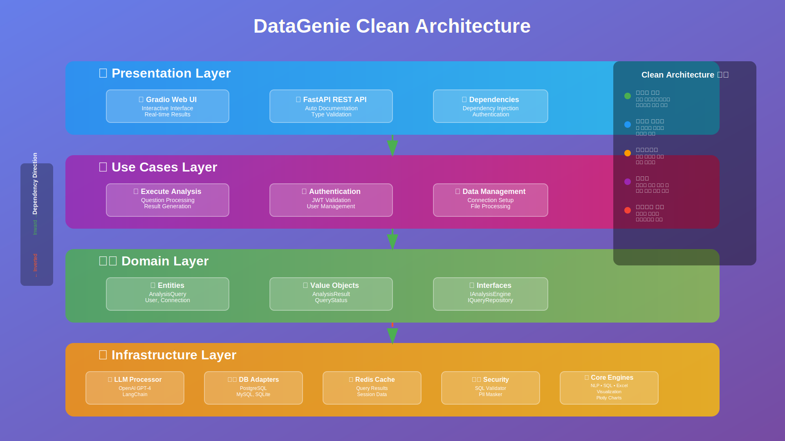

# DataGenie 발표자료 🧞‍♂️

DataGenie 프로젝트의 코드베이스 분석을 바탕으로 제작된 발표자료입니다.

## 📁 구성 요소

### React 컴포넌트
- `DataGeniePresentation.jsx` - 메인 발표 컴포넌트 (16:9 비율)
- `DataGeniePresentation.css` - 발표자료 스타일시트

### SVG 다이어그램 (16:9 비율)
- `architecture-diagram.svg` - Clean Architecture 구조도
- `data-flow-diagram.svg` - 데이터 플로우 및 LLM 통합 다이어그램
- `tech-stack-diagram.svg` - 기술 스택 및 의존성 다이어그램

## 🎯 발표 슬라이드 구성

1. **타이틀 슬라이드** - 프로젝트 소개
2. **프로젝트 개요** - 목표, 핵심 기능, 보안 원칙, 성능
3. **Clean Architecture 구조** - 계층별 구성 및 장점
4. **기술 스택** - 사용된 기술들과 선정 이유
5. **데이터 플로우** - 처리 과정 및 캐싱 전략
6. **LLM 통합 전략** - AI 활용 방법 및 프롬프트 엔지니어링
7. **보안 아키텍처** - 다층 보안 체계
8. **성능 최적화** - 메트릭 및 최적화 전략
9. **사용 예시** - 실제 사용 시나리오
10. **개발 로드맵** - 진행 상황 및 향후 계획
11. **결론 및 향후 계획** - 성과 및 다음 단계

## 🚀 사용 방법

### React 컴포넌트 실행

```bash
# 의존성 설치
npm install react react-dom

# 컴포넌트 import
import DataGeniePresentation from './DataGeniePresentation';

# 사용
<DataGeniePresentation />
```

### SVG 다이어그램 사용

SVG 파일들은 독립적으로 사용 가능하며, 웹 브라우저에서 직접 열거나 다른 문서에 임베드할 수 있습니다.

```html
<!-- HTML에서 사용 -->


<!-- 또는 인라인으로 사용 -->
<object data="svg-diagrams/data-flow-diagram.svg" type="image/svg+xml"></object>
```

## 🎨 디자인 특징

### 16:9 비율
모든 다이어그램과 슬라이드는 1920x1080 (16:9) 비율로 제작되어 프레젠테이션에 최적화되었습니다.

### 색상 체계
- **Primary**: #667eea → #764ba2 (그라데이션 배경)
- **Accent Colors**:
  - 🌐 Presentation: #2196F3 (파란색)
  - 💼 Use Cases: #9C27B0 (보라색)
  - 🏛️ Domain: #4CAF50 (초록색)
  - 🔧 Infrastructure: #FF9800 (주황색)
  - ❌ Error: #F44336 (빨간색)

### 반응형 디자인
CSS는 다양한 화면 크기에 대응하는 반응형 디자인을 지원합니다.

## 📊 다이어그램 상세

### Architecture Diagram
- Clean Architecture의 4개 계층 시각화
- 의존성 방향 표시
- 각 계층별 주요 컴포넌트 나열
- 아키텍처 장점 설명

### Data Flow Diagram
- 사용자 입력부터 최종 출력까지의 전체 플로우
- 데이터베이스 쿼리와 Excel 분석의 분기 처리
- 에러 처리 및 캐싱 전략 표시
- 성능 메트릭 포함

### Tech Stack Diagram
- 11개 카테고리별 기술 스택 분류
- 각 기술의 버전 정보 및 주요 기능
- 의존성 관계 화살표로 표시
- 기술 스택 특징 요약

## 🔧 커스터마이징

### 색상 변경
CSS 파일의 그라데이션 정의를 수정하여 색상을 변경할 수 있습니다:

```css
:root {
  --primary-gradient: linear-gradient(135deg, #667eea 0%, #764ba2 100%);
  --accent-color: #4CAF50;
}
```

### 슬라이드 추가
`DataGeniePresentation.jsx`의 `slides` 배열에 새로운 슬라이드 객체를 추가:

```javascript
{
  id: 'new-slide',
  title: '새 슬라이드',
  content: (
    <div className="new-slide">
      {/* 슬라이드 내용 */}
    </div>
  )
}
```

## 📱 브라우저 지원

- Chrome 90+
- Firefox 88+
- Safari 14+
- Edge 90+

## 📄 라이선스

이 발표자료는 DataGenie 프로젝트의 일부로, MIT 라이선스 하에 배포됩니다.

---

**🧞‍♂️ DataGenie 발표자료로 프로젝트의 가치를 효과적으로 전달하세요!**
